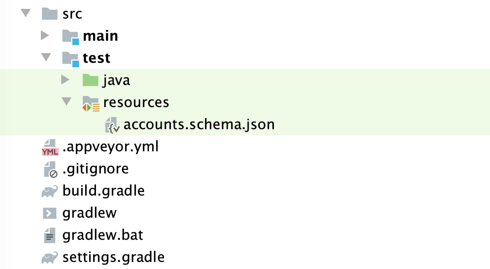

# Домашнее задание к занятию «1.2. Тестирование API, CI»

В качестве результата пришлите ссылку на ваш GitHub-проект в личном кабинете студента на сайте [netology.ru](https://netology.ru).

Первые две задачи этого занятия нужно делать в одном репозитории.

**Важно**: если у вас что-то не получилось, то оформляйте issue [по установленным правилам](../report-requirements.md).

**Важно**: не делайте ДЗ всех занятий в одном репозитории. Иначе вам потом придётся достаточно сложно подключать системы Continuous integration.

## Как сдавать задачи

1. Инициализируйте на своём компьютере пустой Git-репозиторий.
1. Добавьте в него готовый файл [.gitignore](../.gitignore).
1. Добавьте в этот же каталог код вашего приложения, код проекта для решения первой и второй задачи вы можете найти в [репозитории с учебным кодом](https://github.com/netology-code/aqa-code/tree/master/api-ci/rest).
1. Сделайте необходимые коммиты.
1. Создайте публичный репозиторий на GitHub и свяжите свой локальный репозиторий с удалённым.
1. Сделайте пуш — удостоверьтесь, что ваш код появился на GitHub.
1. Выполните интеграцию проекта с Github Actions ([инструкция](../github-actions-integration)) или AppVeyor ([инструкция](../appveyor-integration)) на выбор, удостоверьтесь что автотесты в CI выполняются.
1. Ссылку на ваш проект отправьте в личном кабинете на сайте [netology.ru](https://netology.ru).
1. Задачи, отмеченные, как необязательные, можно не сдавать, это не повлияет на получение зачёта.

В качестве примера можете посмотреть на этот [проект](https://github.com/netology-code-samples/aqa-ci-demo). Ваш по структуре должен выглядеть так же.

## Информация по учебным JAR

JAR файл учебного сервиса поместите в папку artifacts репозитория проекта. Для запуска учебного сервиса, находясь в папке проекта, выполните в терминале команду        
```
java -jar ./artifacts/app-mbank.jar
```

Важно: если вы работаете на Windows с турецкой локалью и при запуске учебных приложений получаете Exception вида:
```
Caused by: java.lang.NoSuchFieldException: wrıteHandlerReference (тут не английская i, а именно ı или ?)
  at java.lang.Class.getDeclaredField(Unknown Source)
  at java.util.concurrent.atomic.AtomicReferenceFieldUpdater$AtomicReferenceFieldUpdaterImpl$1.run(Unknown Source)
  at java.util.concurrent.atomic.AtomicReferenceFieldUpdater$AtomicReferenceFieldUpdaterImpl$1.run(Unknown Source)
  at java.security.AccessController.doPrivileged(Native Method)
  ... 21 more
```

тогда вам все JAR нужно будет запускать командой:
```
java -Duser.language=en -Duser.country=US -jar ./artifacts/app-mbank.jar
```

Часть `./artifacts/app-mbank.jar` может меняться в зависимости от имени файла учебного сервиса и папки с ним, но первая часть для вас во всех ДЗ при запуске на вашем ПК будет именно такой.

## Задача №1: настройка CI

Напоминаем, CI — это чаще всего отдельная система — сервер, набор серверов, облако — в которой ваш код и ваши автотесты собираются в автоматическом режиме без вашего непосредственного участия. Вы лишь настраиваете CI для того, чтобы при возникновении определённых событий, например, push в репозиторий, стартовал процесс сборки и прогона тестов.

Детальнее про CI вы можете узнать, погуглив «Continuous integration», «Jenkins», «GitLab CI», «GitHub Actions», «AppVeyor», «Travis», «CircleCI».

Что нужно сделать:

#### Шаг 1. Получить код проекта

Получить код проекта для решения первой и второй задач можно выполнив следующие шаги:   
1. Клонируйте [репозиторий с примерами учебного кода](https://github.com/netology-code/aqa-code/tree/master) во временную папку на локальный компьютер       
2. Из папки /api-ci/rest локальной копии репозитория aqa-code копируйте содержимое в папку проекта с решением задачи

#### Шаг 2. Настроить интеграцию с CI     

После добавления кода в проект с решением задачи необходимо настроить его интеграцию с одной из систем CI на выбор: Github Actions ([инструкция](../github-actions-integration)) или AppVeyor ([инструкция](../appveyor-integration)).    
      
**Важно**: иногда можно настроить CI так, что там **всегда будет success** 😈! Не забывайте убедиться, что в CI сборка действительно падает, если вы запушите в GitHub падающий тест.

<details>
  <summary>Подсказка</summary>
  
  Возможно, это как-то связано с файлом gradlew и правами доступа на него. Для добавления прав на запуск файла gradlew, добавьте в CI исполнение команды `chmod +x gradlew` перед тем как использовать этот файл как команду для работы с гредлом. 
</details>

Общая схема работы выглядит следующим образом: CI должен запустить целевой сервис, который вы и тестируете, в фоновом режиме и ваши автотесты. Для этого мы будем на этот раз использовать возможности Bash.

Для того чтобы запустить целевой сервис, есть несколько вариантов, самый простой из которых — положить JAR-файл прямо в ваш репозиторий. Когда система CI будет выкачивать исходники автотестов, он выкачает и ваш сервис.

Конечно, вы должны понимать, что в реальной жизни артефакты (собранный целевой сервис) хранятся в специальных системах, и процесс выкачивания будет зависеть от того, где и как хранится артефакт.

Ваш целевой сервис (SUT — System under test), расположен в файле [app-mbank.jar](app-mbank.jar), этот же файл используется в примерах на лекции. Вам нужно его положить в каталог `artifacts` вашего проекта, который необходимо создать.

Поскольку файлы с расширением `.jar` находятся в списках `.gitignore`, вам нужно принудительно заставить Git следить за ними: `git add -f artifacts/app-mbank.jar`.

После чего сделать `git push`. Обязательно удостоверьтесь, что файл попал в репозиторий.

**Важно: не забудьте добавить бейдж сборки в репозиторий проекта. Убедитесь, что вы не скопировали бейджик с другого проекта.**

## Задача №2: JSON Schema

JSON Schema предлагает нам инструмент валидации JSON-документов. С описанием вы можете познакомиться по [адресу](https://json-schema.org/understanding-json-schema).

Как строится схема: 
```js
{
  "$schema": "http://json-schema.org/draft-07/schema", // версия схемы: https://json-schema.org/understanding-json-schema/reference/schema.html
  "type": "array", // тип корневого элемента: https://json-schema.org/understanding-json-schema/reference/type.html
  "items": { // какие элементы допустимы внутри массива: https://json-schema.org/understanding-json-schema/reference/array.html#items
    "type": "object", // должны быть объектами: https://json-schema.org/understanding-json-schema/reference/object.html
    "required": [ // должны содержать следующие поля: https://json-schema.org/understanding-json-schema/reference/object.html#required-properties
      "id",
      "name",
      "number",
      "balance",
      "currency"
    ],
    "additionalProperties": false, // дополнительных полей быть не должно 
    "properties": { // описание полей: https://json-schema.org/understanding-json-schema/reference/object.html#properties
      "id": {
        "type": "integer" // целое число: https://json-schema.org/understanding-json-schema/reference/numeric.html#integer
      },
      "name": {
        "type": "string", // строка: https://json-schema.org/understanding-json-schema/reference/string.html
        "minLength": 1 // минимальная длина — 1: https://json-schema.org/understanding-json-schema/reference/string.html#length
      },
      "number": {
        "type": "string", // строка: https://json-schema.org/understanding-json-schema/reference/string.html
        "pattern": "^•• \\d{4}$" // соответствует регулярному выражению: https://json-schema.org/understanding-json-schema/reference/string.html#regular-expressions
      },
      "balance": {
        "type": "integer" // целое число: https://json-schema.org/understanding-json-schema/reference/numeric.html#integer
      },
      "currency": {
        "type": "string" // строка: https://json-schema.org/understanding-json-schema/reference/string.html
      }
    }
  }
}
```

Начнем с изучения проекта, проверим необходимые условия для его реализации.   

Что нужно сделать:    

#### Шаг 1. Зависимости проекта

```groovy
dependencies {
    testImplementation 'io.rest-assured:rest-assured:5.5.0'
    testImplementation 'io.rest-assured:json-schema-validator:5.5.0'
    testImplementation 'org.junit.jupiter:junit-jupiter:5.10.2'
}
```

#### Шаг 2. JSON схема    

В каталоге `resources` в `src/test` и должен лежать файл схемы.    



#### Шаг 3. Проверка ответа сервиса на соответсвие схеме    

Один из классов проекта должен содержать операцию проверки соответствия ответа схеме. 

```java
      // код теста
      .then()
          .statusCode(200)
          .body(matchesJsonSchemaInClasspath("accounts.schema.json"));
```

В тестовом классе должен быть импорт статического метода        

```java
import static io.restassured.module.jsv.JsonSchemaValidator.matchesJsonSchemaInClasspath;
```

Удостоверьтесь, что тесты проходят при соответствии ответа схеме и падают, если вы поменяете что-то в схеме, например, тип для `id`.

#### Шаг 4. Доработать схему

Изучите документацию на тип [`object`](https://json-schema.org/understanding-json-schema/reference/object.html) и найдите способ валидации значения поля на два из возможных значений: «RUB» или «USD».

Доработайте схему соответствующим образом, удостоверьтесь, что тесты проходят, в том числе в CI.

Поменяйте «RUB» на «RUR» в схеме и удостоверьтесь, что тесты падают, в том числе в CI.

Пришлите на проверку ссылку на ваш репозиторий. Удостоверьтесь, что в истории сборки были как success, так и fail, иначе будет не видно, как вы проверяли, что сборка падает в CI.

## Задача №3: Postman Echo

**Важно**: эту задачу нужно выполнять в отдельном репозитории.

В этой задаче мы сэмулируем ситуацию, в которой SUT уже запущен, а мы из теста просто обращаемся к нему.

Есть специальный сервис, предназначенный для тестирования HTTP-запросов. Называется он [Postman Echo](https://docs.postman-echo.com). Никогда не тестируйте автоматизированными средствами веб-сервисы, если у вас нет на это письменного разрешения или если веб-сервисы специально не предназначены для этого.

Мы можем отправлять туда запросы и получать ответы.

С GET-запросами мы немного потренировались, теперь нас будут интересовать POST-запросы, а именно отправка тела запроса:

```java
// Given - When - Then
// Предусловия
given()
  .baseUri("https://postman-echo.com")
  .body("some data") // отправляемые данные (заголовки и query можно выставлять аналогично)
// Выполняемые действия
.when()
  .post("/post")
// Проверки
.then()
  .statusCode(200)
  .body(/* --> ваша проверка здесь <-- */)
;
```

Что нужно сделать:
1. Создайте новый проект на базе Gradle.
2. Добавьте необходимые зависимости. Если вы не пишите схему, то только REST assured.
3. Напишите тест, взяв сам запрос из кода выше.
4. Изучите ответ и напишите JSONPath-выражение вместо строк `/* --> ваша проверка здесь <--*/`, которое проверит, что в нужном поле хранятся отправленные вами данные. Обратите внимание, теперь у вас не массив, а объект.

Можете воспользоваться сервисами [jsonpath-tester](https://extendsclass.com/jsonpath-tester.html) или [jsonpath](https://jsonpath.com/) для быстрой проверки выражений. Описание синтаксиса [тут](https://testerslittlehelper.wordpress.com/2019/01/20/jsonpath-in-rest-assured/) и [тут](https://github.com/rest-assured/rest-assured/wiki/Usage#json-using-jsonpath).

Удостоверьтесь, что если вы будете использовать неверное выражение, то тесты упадут, в том числе и в CI.

Обратите внимание: если вам приходит вот такой объект:
```json
{
    "data": "some value"
}
```

то обратиться к нему с помощью JSONPath можно вот так: `data`, например: `.body("data", equalTo("some value"))`. То есть обращение к полю верхнеуровневого объекта, который называется безымянным, идёт без точки. В примере на лекциях у нас был массив и мы сразу обращались `[0]` — то же самое.

Если соберётесь отправлять текст не на латинице, то вам нужно будет выставлять кодировку, например, UTF-8:
```java
given()
  .baseUri("https://postman-echo.com")
  .contentType("text/plain; charset=UTF-8")
  .body("some data")
.when()
  .post("/post")
.then()
  .statusCode(200)
  .body(/* --> ваша проверка здесь <-- */)
;
```

Пришлите ссылку на ваш репозиторий. Удостоверьтесь, что в истории сборки были как success, так и fail, иначе будет не видно, как вы проверяли, что сборка падает в CI.
