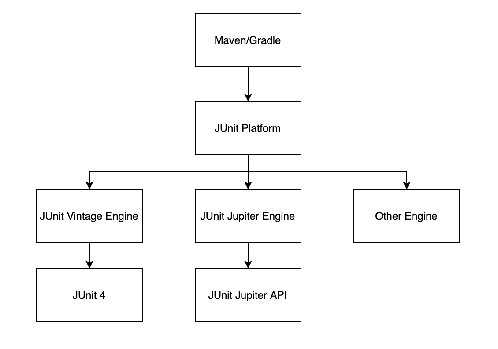
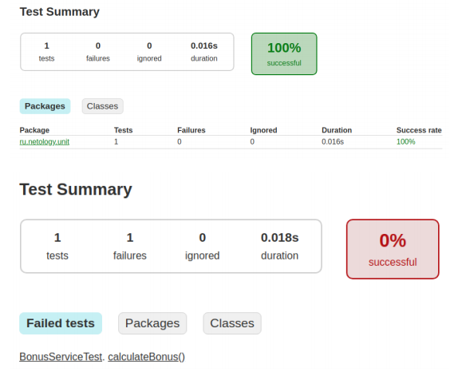

# Домашнее задание к занятию «1.1. Основы автоматизации»

[Инструкция по созданию нового проекта](project_creation)

В качестве результата пришлите ссылку на ваш GitHub-проект в личном кабинете студента на сайте [netology.ru](https://netology.ru).

Все задачи этого занятия нужно делать **в одном репозитории**.

**Важно**: если у вас что-то не получилось, то оформляйте Issue [по установленным правилам](../report-requirements.md).

## Как сдавать задачи

1. Инициализируйте на своём компьютере пустой Git-репозиторий.
1. Добавьте в него готовый файл [.gitignore](../.gitignore).
1. Добавьте в этот же каталог код вашего приложения.
1. Сделайте необходимые коммиты.
1. Создайте публичный репозиторий на GitHub и свяжите свой локальный репозиторий с удалённым. Не забудьте настроить CI на ветках или PR.
1. Сделайте пуш — удостоверьтесь, что ваш код появился на GitHub.
1. Если ваши тесты нашли баг — создайте баг-репорт в GitHub Issue.
1. Ссылку на ваш проект отправьте в личном кабинете на сайте [netology.ru](https://netology.ru).
1. Задачи, отмеченные как необязательные, можно не сдавать, это не повлияет на получение зачёта.


## Задача №1: CashBackHacker

### Введение

Вы участвуете в проекте CashBackHacker — это небольшой сервис, который сообщает пользователю о том, сколько ему нужно докупить в рамках конкретной траты, чтобы получить максимальное количество кешбека.

Подробнее: кешбек начисляется за каждую потраченную полную тысячу рублей, поэтому, если вы покупаете что-то на 900 рублей, сервис должен посоветовать вам докупить ещё чего-нибудь на 100 рублей.

Код сервиса выглядит следующим образом:

```java
package ru.netology.service;

public class CashbackHackService {
    private final int boundary = 1000;

    public int remain(int amount) {
        return boundary - amount % boundary;
    }
}
```

Вам нужно создать проект на базе Gradle, как на лекции, не добавляя в него внешних зависимостей.

Выложите полученный проект на GitHub. Не забудьте о файле [.gitignore](../.gitignore). Подключите GitHub Actions. Можете воспользоваться [примером файла](./gradle.yml) для конфигурации gradle-сборки в Github Actions.

### Легенда

Поскольку вы уже умеете работать с JUnit5, вам поручили провести небольшое исследование, в рамках которого попробовать использовать TestNG и JUnit4 — тот самый пресловутый кейс — попробуем что-то сделать, а потом уже будем принимать решения.

### Часть 1. TestNG

#### Описание

TestNG сравнительно неплохо [документирован](https://testng.org/#_testng_documentation).

На этом уровне, **с точки зрения пользователя**, почти всё, что поменяется, — мы подключим другую библиотеку и будем использовать аннотации из неё и asserts.

[Ключевые аннотации](https://testng.org/#_annotations) (вы можете прочитать [Javadoc](https://www.javadoc.io/doc/org.testng/testng/7.1.0/org/testng/annotations/package-summary.html)).

[Ключевые asserts](https://testng.org/#_success_failure_and_assert) (вы можете прочитать [Javadoc](https://www.javadoc.io/doc/org.testng/testng/7.1.0/org/testng/asserts/package-summary.html)).

#### Что нужно сделать

Сделайте ветку testng, в которой:

1\. Добавьте в зависимости TestNG:
```groovy
dependencies {
    testImplementation 'org.testng:testng:7.1.0'

}

test {
    useTestNG()
}
```

2\. Напишите простые автотесты без параметризации на основании материала следующего раздела.

#### Особенности

На этом уровне для нас поменяется всего три вещи:
1. Аннотация `@Test` должна иметь Fully Qualified Name `org.testng.annotations.Test`.
2. Asserts расположены в классе `org.testng.Assert`. **Обратите внимание**: в TestNG принято `actual, expected` вместо `expected, actual`.
3. Класс и тестовые методы должны иметь модификатор доступа `public`. Именно поэтому мы вам рекомендовали прописывать модификаторы в тестовых классах. 

### Часть 2. JUnit4

#### Описание

JUnit4, по сравнению с JUnit5, практически не документирован, поэтому всё, что нам доступно, — это [Javadoc](https://junit.org/junit4/javadoc/latest/index.html) и [FAQ](https://junit.org/junit4/faq.html).

На этом уровне, **с точки зрения пользователя**, почти всё, что поменяется, — мы подключим другую библиотеку и будем использовать аннотации из неё и asserts.

Ключевые аннотации (вы можете прочитать Javadoc на них):
 

Ключевые asserts (вы можете прочитать Javadoc на них):
 


#### Что нужно сделать

Сделайте ветку junit4, в которой:

1\. Добавьте в зависимости JUnit:
```groovy
dependencies {
    testImplementation 'junit:junit:4.13'
}

test {
    useJUnit()
}
```

2\. Напишите простые автотесты без параметризации.

#### Особенности

На этом уровне для нас поменяется всего три вещи:
1. Аннотация `@Test` должна иметь Fully Qualified Name `org.junit.Test`.
2. Asserts расположены в классе `org.junit.Assert`.
3. Класс и тестовые методы должны иметь модификатор доступа `public`. Именно поэтому мы вам рекомендовали прописывать модификаторы в тестовых классах.

### Об ошибках

В сервисе точно есть ошибка, поэтому один из ваших автотестов должен падать. На обнаруженный дефект должен быть оформлен репорт [по установленным правилам](../report-requirements.md) 

<details>
    <summary>Подсказка</summary>

    Если пользователь купил ровно на 1000 рублей, то приложение не должно ему говорить, что нужно купить ещё на 1000.
</details>

## Задача №2: JUnit5 и legacy (необязательно)

## Легенда

Автотесты — это тоже код, и он подвержен тем же проблемам, что и обычный код.

Довольно часто встречается ситуация, когда в вашем проекте большое наследие (legacy) кода автотестов, например, на JUnit4.

Но новые тесты хочется писать, используя JUnit5. Что же делать в этом случае?

## Описание

JUnit5 представляет из себя комплексный проект, состоящий из трёх частей: JUnit Platform + JUnit Jupiter + JUnit Vintage.

 

До этого мы достаточно вольно использовали названия JUnit5 и JUnit Jupiter, фактически как синонимы, но начиная с этого ДЗ, мы должны их различать.

- JUnit Platform отвечает за запуск тестовых фреймворков на JVM и определяет интерфейс [`TestEngine`](https://junit.org/junit5/docs/current/api/org.junit.platform.engine/org/junit/platform/engine/TestEngine.html). Это интерфейс, определяющий движок для поиска и запуска тестов. 
- JUnit Jupiter определяет API и реализацию `TestEngine` для запуска тестов, использующих данное API, junit-jupiter-engine — уже готовая реализация `JupiterTestEngine`.
- JUnit Vintage предоставляет `TestEngine` для запуска тестов, использующих JUnit4 и JUnit3.

#### Что нужно сделать

Из ветки junit4 создайте ветку junit4-platform, в которой:

1\. Добавьте в зависимости JUnit Vintage:
```groovy
dependencies {
    testImplementation 'junit:junit:4.13'
    testRuntimeOnly 'org.junit.vintage:junit-vintage-engine:5.6.2'
}

test {
    useJUnitPlatform()
}
```

2\. Удостоверьтесь, что ваши тесты запускаются.

3\. Добавьте в зависимости JUnit Jupiter (по факту — замените код из п.1):
```groovy
dependencies {
    testImplementation 'org.junit.jupiter:junit-jupiter-api:5.6.1'
    testRuntimeOnly 'org.junit.jupiter:junit-jupiter-engine:5.6.1'

    testImplementation 'junit:junit:4.13'
    testRuntimeOnly 'org.junit.vintage:junit-vintage-engine:5.6.2'
}

test {
    useJUnitPlatform()
}
```

4\. Напишите те же тесты, но с использованием API JUnit Jupiter.

5\. Удостоверьтесь, что запускаются и тесты JUnit4, и тесты JUnit Jupiter.

6\. Соберите отчёты и запакуйте их в zip-архив. Напоминаем, они должны выглядеть примерно так:



7\. Создайте в проекте issue, к которому приложите отчёты. В личном кабинете вам нужно будет отправить ссылку на тот issue, что вы создали для демонстрационного проекта: https://github.com/netology-code/aqa-hw-sample/issues/1.
