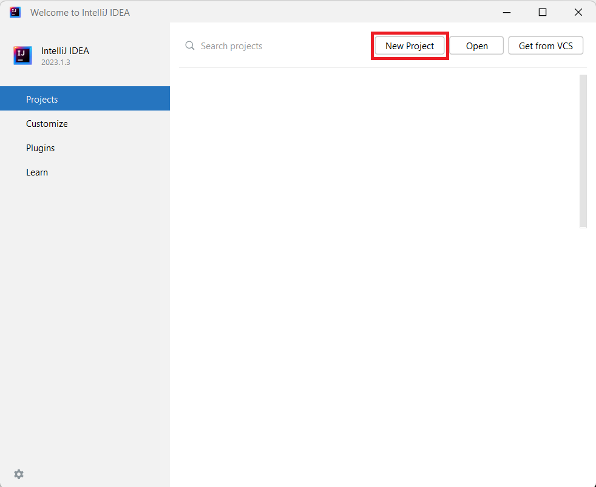
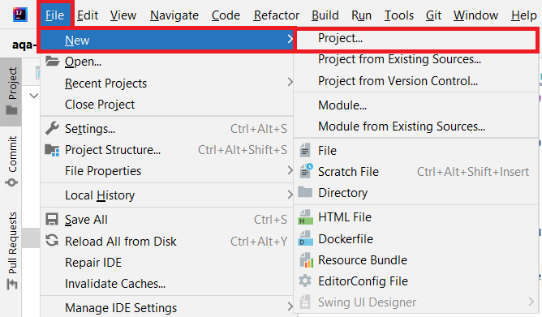
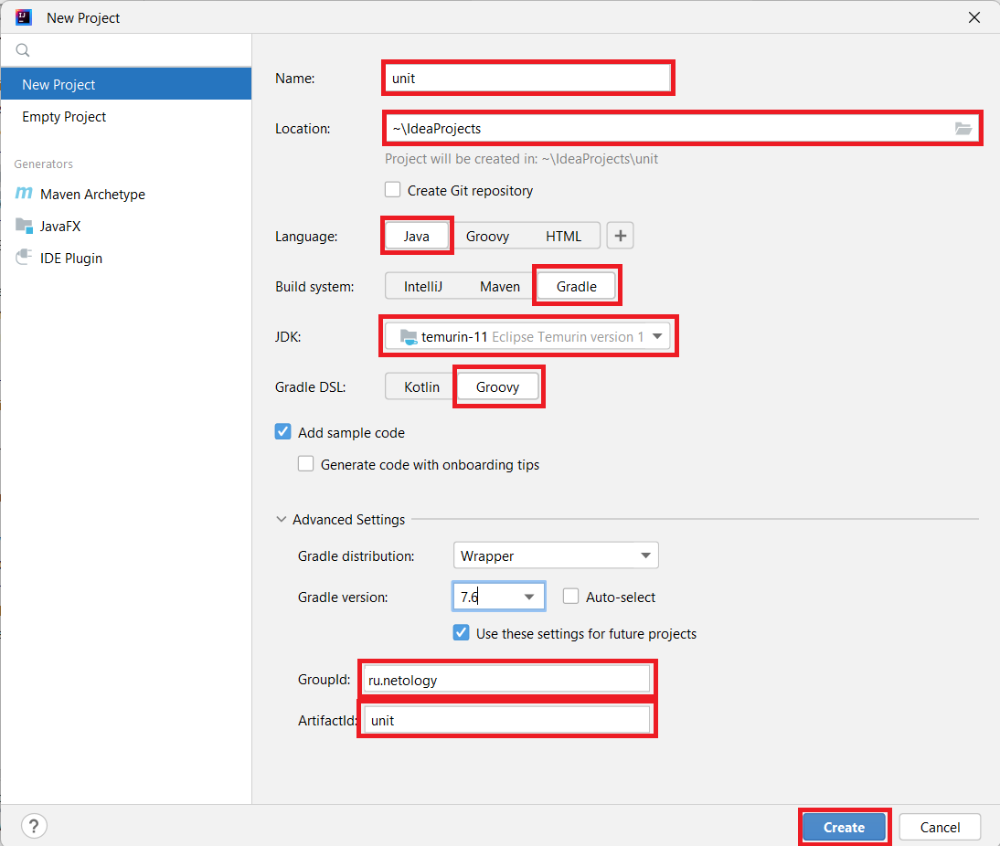

# Создание нового проекта в IntelliJ IDEA

Перед созданием нового проекта необходимо выполнить [инструкцию по установке JDK и переменных окружения](../../jdk_install)

1. После первого запуска программы IntelliJ IDEA Вы увидите окно приглашения    

     

для создания первого проекта нажмите кнопку **New Project**    

2. Если проект был создан ранее и открыт, то для создания нового проекта необходимо последовательно выбрать пункты меню **File** -> **New** -> **Project**     

  

3. Установите параметры нового проекта и нажмите **Create**      

     

- Name - имя проекта
- Location - расположение файловой системе    
- Language - Java
- Build system - Gradle
- JDK - установленная версия JDK 11    
- Gradle DSL - Groovy    
- GroupId - ru.netology    
- ArtifactId - по имени проекта

