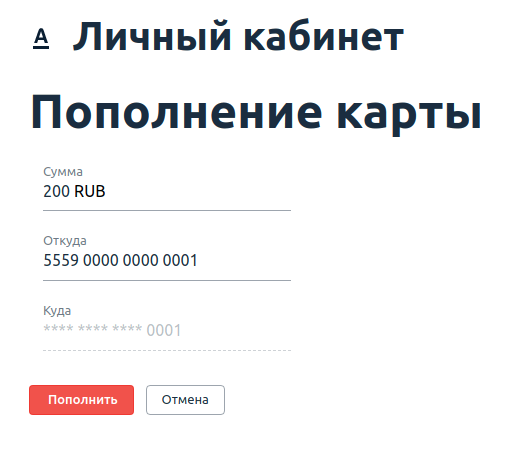

# Домашнее задание к занятию «2.4. BDD»

В качестве результата пришлите ссылки на ваши GitHub-проекты в личном кабинете студента на сайте [netology.ru](https://netology.ru).

Все задачи этого занятия нужно делать **в разных репозиториях**.

**Важно**: если у вас что-то не получилось, то оформляйте Issue [по установленным правилам](../report-requirements.md).

**Важно**: не делайте ДЗ всех занятий в одном репозитории! Иначе вам потом придётся достаточно сложно подключать системы Continuous Integration.

## Как сдавать задачи

1. Инициализируйте на своём компьютере пустой Git-репозиторий
1. Добавьте в него готовый файл [.gitignore](../.gitignore)
1. Добавьте в этот же каталог код ваших авто-тестов
1. Сделайте необходимые коммиты
1. Добавьте в каталог `artifacts` целевой сервис (`app-ibank-build-for-testers.jar`)
1. Создайте публичный репозиторий на GitHub и свяжите свой локальный репозиторий с удалённым
1. Сделайте пуш (удостоверьтесь, что ваш код появился на GitHub)
1. Удостоверьтесь, что в Appveyor сборка выполняется: запускается тестируемый сервис и тесты. При отсутствии багов в сервисе сборка должна быть зелёной
1. Поставьте бейджик сборки вашего проекта в файл README.md
1. Ссылку на ваш проект отправьте в личном кабинете на сайте [netology.ru](https://netology.ru)
1. Задачи, отмеченные, как необязательные, можно не сдавать, это не повлияет на получение зачета
1. Если вы обнаружили подозрительное поведение SUT (похожее на баг), создайте описание в Issue на GitHub. [Придерживайтесь схемы при описании](../report-requirements.md).
1. Если в проекте реализован тест(тесты), направленные на поиск описанных в Issues багов тестируемого сервиса, то такие тесты будут падать до исправления багов сервиса, сборка в Appveyor будет красной

## Настройка CI
    
Настройка CI осуществляется аналогично предыдущему заданию. Поскольку у вас итак "специальная тестовая сборка", то ничего в самом сервисе делать не нужно.

## Задача №1 - Page Object's

Вам необходимо "добить" тестирование функции перевода с карты на карту. Разработчики пока реализовали возможность перевода только между своими картами, но уже хотят, чтобы вы всё протестировали.

Для этого они не поленились и захардкодили вам целого одного пользователя:
```
* login: 'vasya'
* password: 'qwerty123'
* verification code (hardcoded): '12345'
* cards:
    * first:
        * number: '5559 0000 0000 0001'
        * balance: 10 000 RUB
    * second:
        * number: '5559 0000 0000 0002'
        * balance: 10 000 RUB
```

После логина (который уже мы сделали на лекции), вы получите список карт:


Нажав на кнопку "Пополнить" вы перейдёте на страницу перевода средств:



При успешном переводе, вы вернётесь назад на страницу со списком карт.

Это ключевой кейс, который нужно протестировать.

Нужно, чтобы вы через Page Object'ы добавили доменные методы:
* Перевода с определённой карты на другую карту n'ой суммы
* Проверки баланса по карте (со страницы списка карт)

**Вы можете познакомиться с некоторыми подсказками [по реализации этой задачи](balance.md)**.

PS: чтобы вам было не скучно, мы там добавили порядком багов, поэтому как минимум одно Issue в GitHub у вас должно быть 😈.

<details>
    <summary>Подсказка</summary>
    
    Обратите внимание на то, что ваши тесты должны проходить целиком (т.е. весь набор тестов). Мы как всегда заложили там небольшую ловушку, чтобы вам не было скучно 😈.
    
    Не закладывайтесь на то, что на картах для каждого теста всегда одна и та же фиксированная сумма, подумайте, как работать с SUT так, чтобы не приходилось её (SUT) перезапускать для каждого теста.
</details>

## Задача №2 - BDD (необязательная)

Используя Page Object'ы из предыдущей задачи, на базе шаблона Akita с лекции реализуйте кастомные Steps:
* Когда он переводит "5 000" рублей с карты с номером "5559 0000 0000 0002" на свою "1" карту с главной страницы;
* Тогда баланс его "1" карты из списка на главной странице должен стать "15 000" рублей.

Тогда, вместе с логином, который мы сделали на лекции, всё должно выглядеть вот так:
* Пусть пользователь залогинен с именем "vasya" и паролем "qwerty123";
* Когда он переводит "5 000" рублей с карты с номером "5559 0000 0000 0002" на свою "1" карту с главной страницы;
* Тогда баланс его "1" карты из списка на главной странице должен стать "15 000" рублей.
