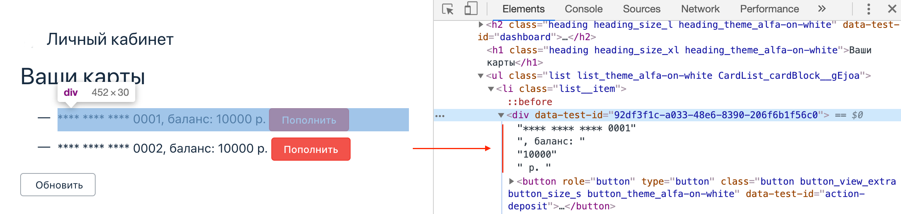

Для того, чтобы получить информацию о текущем балансе карт, вам необходимо написать вспомогательный метод (в одном из ваших PageObjects), который из содержимого элемента получает значение баланса.

Как работать с объектами, методами (чистая Java), селекторами (Selenide) и Page Object'ами вы уже знаете, поэтому нас будет интересовать только техническая сторона вопроса.

Итак, переходим на нужную нам страницу и открываем DevTools, выбирая элемент с балансом:



Видим следующую вещь: содержимое элемента представляет из себя следующую строку:

```
**** **** **** 0001, баланс: 10000 р.
```

Но помимо строки с данными, там же есть ещё кнопка?

Давайте накидаем Page Object и посмотрим, что мы получим:


Т.е. метод `text` возвращает и текст на кнопке тоже.

В итоге мы получаем:
```
**** **** **** 0001, баланс: 10000 р.\nПополнить
```

Теперь давайте внимательно посмотрим на эту строку: сама сумма располагается между `баланс: ` и `р.`. Т.е. если мы сможем "вытащить" оттуда эту часть строки и преобразовать её к `int`, то получим нужные нам данные*.

Примечание*: мы не стали усложнять для вас пример, но вы должны помнить о копейках и о том, что некоторые банки не показывают копейки, если они по нулям (00), а показывают только если там действительно они есть:


Примечание: скриншоты Банка Тинькофф

А ещё запятые вместо точек, пробелы и т.д. - в общем, полная жуть.

Поэтому придётся мучаться либо договариваться с разработчиками, чтобы они куда-нибудь положили сумму в атрибут (в нормальном виде).

Итак - у нас есть строка, из неё нужно вырезать кусок. Давайте обратимся к документации класса [`String`](https://docs.oracle.com/en/java/javase/11/docs/api/java.base/java/lang/String.html).

Нас будут интересовать два метода:
1. `indexOf` - возвращает позицию, с которой начинается подстрока в строке
1. `substring` - вырезает подстроку из строки 

Почитайте на них обязательно документацию, мы же покажем вам упрощённую реализацию:
```java
public class DashboardPage {
  // к сожалению, разработчики не дали нам удобного селектора, поэтому так
  private ElementsCollection cards = $$(".list__item div");
  private final String balanceStart = "баланс: ";
  private final String balanceFinish = " р.";

  public Dashboard() {
  }

  public int getFirstCardBalance() {
    val text = cards.first().text();
    return extractBalance(text);
  }

  private int extractBalance(String text) {
    val start = text.indexOf(balanceStart);
    val finish = text.indexOf(balanceFinish);
    val value = text.substring(start + balanceStart.length(), finish);
    return Integer.parseInt(value);
  }
}
```

Таким образом, метод `getFirstCardBalance` умеет получать баланс карты. Не сложно его модифицировать под то, чтобы он назывался `getCardBalance` и умел получать баланс по индексу (см. документацию на `ElementsCollection`).

Важно: это не единственный способ. Можно вычленить баланса через `split(":")` а потом `substring(0, .indexOf("р.")).trim()`;

Ну а дальше по аналогии вы можете реализовать всё остальное, если знаете баланс (а ещё лучше отдавать вызывающему коду не индекс карты, а её id, по которому потом можно проверять успешность или неуспешность проведения платежей). Например:

```java
public class DashboardPage {
  // к сожалению, разработчики не дали нам удобного селектора, поэтому так
  private ElementsCollection cards = $$(".list__item div");
  private final String balanceStart = "баланс: ";
  private final String balanceFinish = " р.";

  public Dashboard() {
  }

  public int getCardBalance(String id) {
    // TODO: перебрать все карты и найти по атрибуту data-test-id
    return extractBalance(text);
  }

  private int extractBalance(String text) {
    val start = text.indexOf(balanceStart);
    val finish = text.indexOf(balanceFinish);
    val value = text.substring(start + balanceStart.length(), finish);
    return Integer.parseInt(value);
  }
}
```
