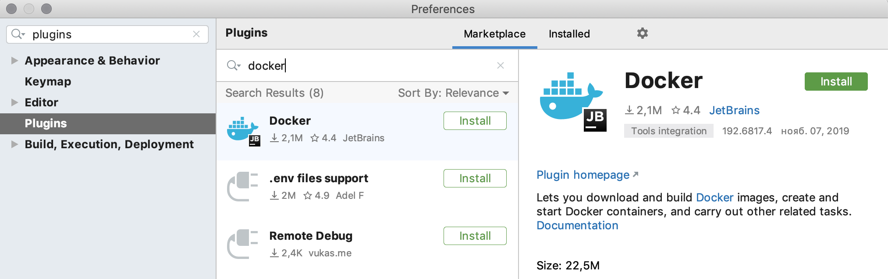
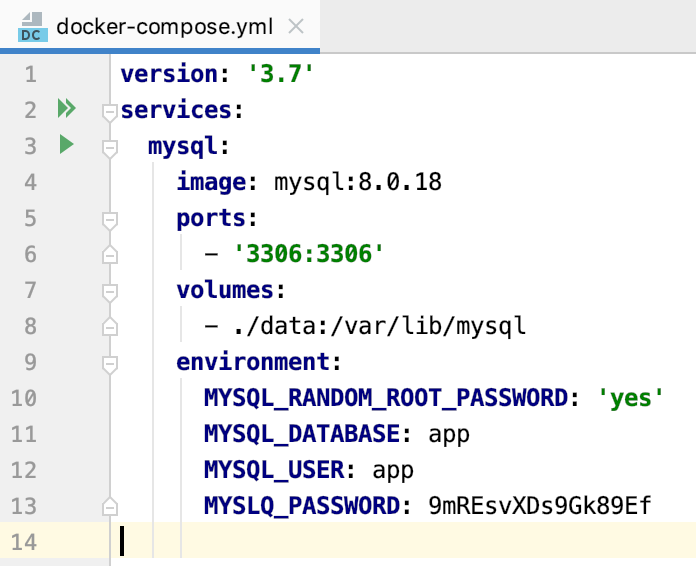
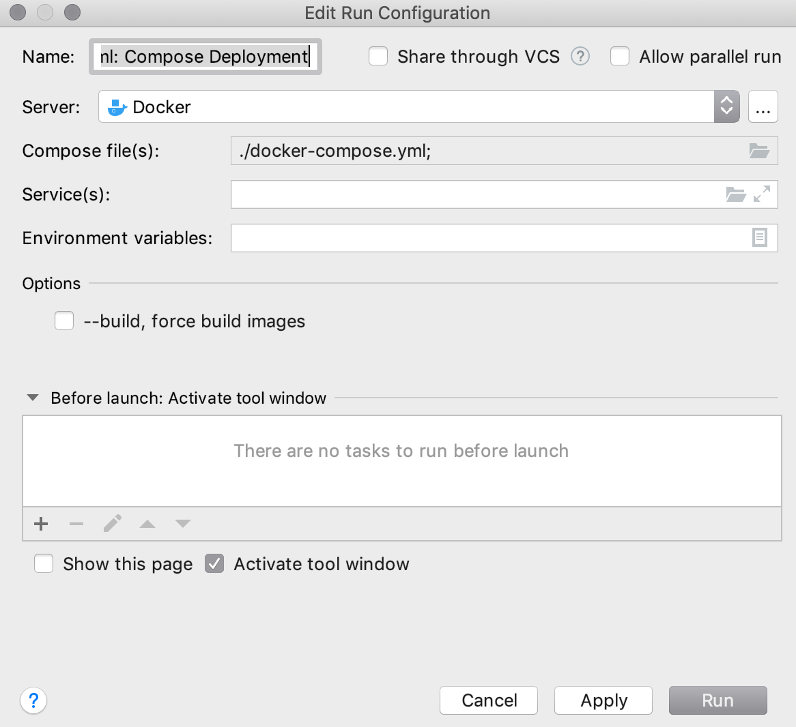
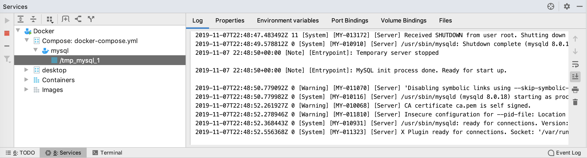
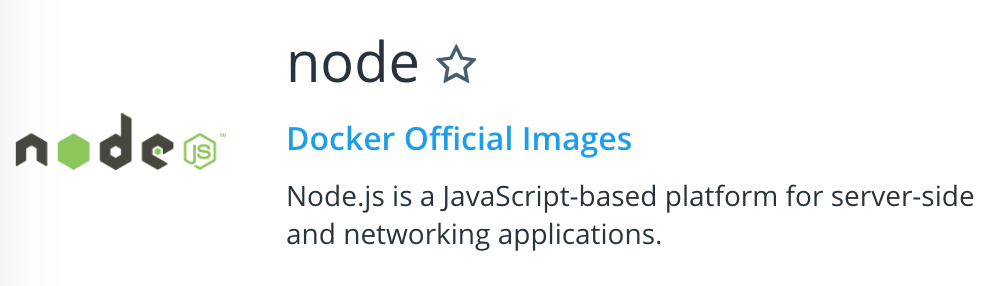

# Домашнее задание к занятию «3.1. Docker»

**Важно**: прежде чем приступать, обязательно прочитайте [Руководство по установке Docker](./installation.md)

В качестве результата пришлите ссылки на ваши GitHub-проекты в личном кабинете студента на сайте [netology.ru](https://netology.ru).

Все задачи этого занятия нужно делать **в разных репозиториях**.

**Важно**: если у вас что-то не получилось, то оформляйте Issue [по установленным правилам](../report-requirements.md).

**Важно**: не делайте ДЗ всех занятий в одном репозитории! Иначе вам потом придётся достаточно сложно подключать системы Continuous Integration.

## Как сдавать задачи

1. Инициализируйте на своём компьютере пустой Git-репозиторий
1. Добавьте в него готовый файл [.gitignore](../.gitignore)
1. Добавьте в этот же каталог код, требуемый в ДЗ
1. Сделайте необходимые коммиты
1. Создайте публичный репозиторий на GitHub и свяжите свой локальный репозиторий с удалённым
1. Сделайте пуш (удостоверьтесь, что ваш код появился на GitHub)
1. Ссылку на ваш проект отправьте в личном кабинете на сайте [netology.ru](https://netology.ru)
1. Задачи, отмеченные, как необязательные, можно не сдавать, это не повлияет на получение зачета

**Важно**: задачи этого занятия не предполагают подключения к CI.

### Plugin IDEA

Этот раздел не является частью ДЗ, но он позволяет вам облегчить себе взаимодействие с Docker и Docker Compose на первое время, воспользовавшись графическим интерфейсом.

Откройте IntelliJ IDEA, перейдите в раздел настроек:
* Windows/Linux: File -> Settings
* MacOS: IntelliJ IDEA -> Preferences

Найдите в поиске раздел Plugins:



Нажмите на кнопку `Install`, после установке перезапустите IDEA.

Теперь при открытии файлов `Dockerfile`, `docker-compose.yml` IDEA будет предлагать автодополнение и возможность запуска прямо из окна редактора:





После запуска откроется окно `Services`, где вы можете посмотреть образы, контейнеры и запущенные с помощью Docker Compose сервисы:



## Задача №1 - PostgreSQL

Вам необходимо подготовить приложение к тестированию на СУБД PostgreSQL (используйте образ 12.0-alpine). Возьмите собранный jar-файл `db-api.jar`, аналогично примеру на лекции положите рядом файл `application.properties`, но в строке:
`jdbc:mysql://...` поменяйте `mysql` на `postgresql`.

Вам нужно дописать остальные настройки (хост, порт, БД, имя пользователя и пароль).

Кроме того, вам нужно подготовить файл `docker-compose.yml`, в котором прописать настройки для запуска контейнера PostgreSQL. Всю информацию о его (контейнера) запуске вы найдёте на официальной странице образа на Docker Hub.

Запустите сначала `docker-compose up` и только после того, как БД запуститься, запустите целевое приложение: `java -jar db-api.jar` (если нужно поменять порт запуска, по умолчанию он 9999, то добавьте в файл `application.properties` строку `server.port=<нужный номер порта>`).

Если вы сделали всё правильно, то приложение запустится и на `GET http://localhost:9999/api/cards` выдаст вам JSON с картами:
```json
[ 
   { 
      "id":1,
      "name":"Альфа-Карта Premium",
      "description":"Альфа-Карта вернёт ваши деньги",
      "imageUrl":"/alfa-card-premium.png"
   },
   { 
      "id":2,
      "name":"Alfa Travel Premium",
      "description":"Самая выгодная карта для путешествий",
      "imageUrl":"/alfa-card-travel.png"
   },
   { 
      "id":3,
      "name":"CashBack Premium",
      "description":"Заправь свою карту. Кэшбэк на АЗС, в кафе и ресторанах",
      "imageUrl":"/alfa-card-cashback.png"
   }
]
```

В результате выполнения этой задачи вы должны положить в репозиторий следующие файлы:
* db-api.jar
* application.properties
* docker-compose.yml

**Важно**: для удаления всех данных (и начала с чистого листа) сделайте следующее:
* `docker-compose down` (в каталоге с файлом `docker-compose.yml`)
* удалите каталог для хранения данных `data`
* запустите заново `docker-compose up` (после того, как всё исправите)

## Задача №2 - Докеризация приложения (необязательная)

Приложение можно упаковать в Docker образ, чтобы затем запускать из него контейнеры.

Сделать это, в принципе, не сложно: достаточно создать файл `Dockerfile`, в котором описать правила сборки образа.

Поскольку наше приложение для Node.js написано на языке JavaScript, то со слов разработчиков:
```
Компилировать ничего не надо.
Нужна только установленная Node.js (версии не ниже 8.16.2).
В командной строке нужно выполнить: npm install для установки зависимостей
Для запуска приложения нужно выполнить: npm start
Приложение запустится на порту 9999
```

Итак, начнём по-порядку. Мы, конечно, можем с нуля собрать образ, но так почти никто не делает. Мы можем взять уже готовый образ, в котором установлена платформа Node.js.

Поскольку мы рассматриваем простейший сценарий, то сборка образа сведётся к следующим инструкциям:
* FROM - выбираем готовый образ для старта (на базе которого мы будем создавать свой)
* WORKDIR - установка рабочего каталога внутри образа
* COPY - копируем файлы из текущего каталога в файловую систему образа
* RUN - выполняем доп.действия, например, установку зависимостей
* CMD - описываем команду запуска
* EXPOSE - описываем какие порты будет слушать контейнер

[Полное описание синтаксиса Dockerfile](https://docs.docker.com/engine/reference/builder/)

Идём на Docker Hub и ищем Node.js:



Начинаем писать наш `Dockerfile`:
```
FROM node:8.16.2-alpine 
```

[Apline Linux](https://wiki.alpinelinux.org/wiki/Docker) - минималистичный образ, который часто используется в качества базового благодаря своим небольшим размерам (около 5 мегабайт). 

Устанавливаем рабочий каталог и пишем команду копирования всех файлов из текущего каталога нашего проекта в образ:
```
FROM 8.16.2-alpine 
WORKDIR /opt/app
COPY . .
```

Запускаем команду установки зависимостей (из инструкции разработчиков)*:
```
FROM node:8.16.2-alpine 
WORKDIR /opt/app
COPY . .
RUN npm install
```

Примечание*: здесь есть нюансы, связанные с послойной организации файловой системы образов Docker, но мы их для простоты изложения проигнорируем.

Прописываем команду старта:
```
FROM node:8.16.2-alpine 
WORKDIR /opt/app
COPY . .
RUN npm install
CMD ["npm", "start"]
```

Да, CMD пишется достаточно странно, но это связано с особенностями обработки. Текущая форма называется `exec form` и представляет из себя JSON-массив в формате: `["executable","param1","param2"]`. О деталях вы можете почитать [на странице описания Dockerfile](https://docs.docker.com/engine/reference/builder/#cmd).

Последнее, что осталось, указать нужные порты (это просто информация для того, кто будет запускать контейнер):

```
FROM node:8.16.2-alpine 
WORKDIR /opt/app
COPY . .
RUN npm install
CMD ["npm", "start"]
EXPOSE 9999
```

Собираем командой:
`docker image build -t node-app:1.0 .`, где `-t` - это задание тега образу.

Если всё соберётся успешно, то вы можете стандартными средствами посмотреть, что теперь ваш образ есть на вашем компьютере:
`docker image ls`.

А также запустить из него контейнер (в том числе с использование Docker Compose).

Можно собрать всё приложение и запустить сразу используя следующую конфигурацию Docker Compose:
```yml
version: '3.7'
services:
  node-app:
    build: .
    image: node-app:1.0
    ports:
      - '9999:9999'
```

`build: .` означает, что мы собираем образ из `Dockerfile`, находящемся в текущем каталоге.

И запускать `docker-compose up --build` (уберите флаг `--build`, чтобы образ не пересобирался каждый раз).

Готовый проект вы можете найти в каталоге `node` (вместе с файлом `docker-compose.yml`).

А теперь - ваша задача: вам нужно взять готовое приложение для контейнеризации `db-api-for-docker.jar` (оно без зависимостей, никакая СУБД ему не нужна) и упаковать в образ (т.е. создать `Dockerfile` и `docker-compose.yml`).

Общие условия:
* приложению для работы нужна Java 8 (используйте в качестве базового образа openjdk:8-slim)
* никаких внешних файлов, кроме самого jar-ника не требуется
* jar'ник запускается командой `java -jar db-api-for-docker.jar` и поднимает сервер на порту 9999 (для теста сделайте `GET http://localhost:9999/api/cards`).

В результате выполнения этой задачи вы должны положить в репозиторий следующие файлы:
* db-api-for-docker.jar
* Dockerfile
* docker-compose.yml
