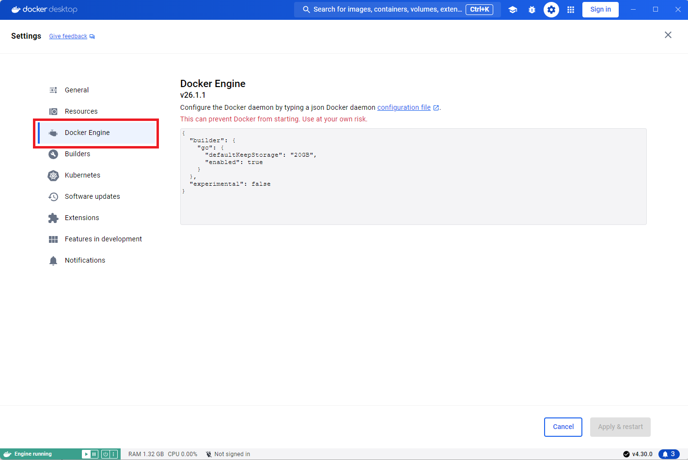
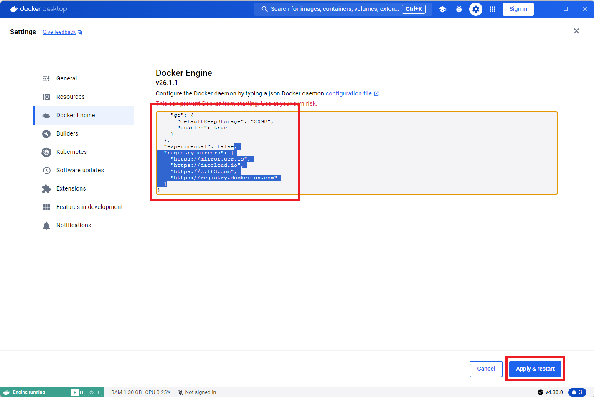

# Инструкция по установке Docker

1. Зарегистрироваться (получить Docker ID) на [Docker Hub](https://hub.docker.com/).

Выбираете `Sign Up`:


Заполняете форму, регистрируйтесь.

2. Определиться с вашей ОС и версией:
* Пользователи Windows 10 и Windows 11 начиная с версии 21H2 - вам нужен Docker Desktop. Установка описана [здесь](https://docs.docker.com/docker-for-windows/install/).
* Пользователи MacOS начиная с Big Sur - вам нужен Docker Desktop. Установка описана [здесь](https://docs.docker.com/docker-for-mac/install/)
* Пользователи Linux, в зависимости от дистрибутива: [Ubuntu](https://docs.docker.com/install/linux/docker-ce/ubuntu/), [Debian](https://docs.docker.com/install/linux/docker-ce/debian/). Не забудьте так же про [Post Installation](https://docs.docker.com/install/linux/linux-postinstall/)
* Пользователи Windows 7, Windows 8, неподдерживаемых версий Windows 10, Windows 11 и MacOS могут использовать виртуальную машину, предоставляемую Нетологией. [Инструкция по подключению к виртуальной машине Linux](./timeweb-instruction.md).    

Q: Что делать, если ничего не получилось?      
A: Обратитесь за консультацией к координатору группы или к преподавателю.

## Дополнительная настройка Docker Desktop

В настоящее время наблюдается нестабильная работа Docker в России, для преодоления трудностей может потребоваться дополнительная настройка движка докера.    

Если при попытке получения образа в логах вы видите сообщение вида         
```
mysql Error pull access denied for mysql, repository does not exist or may require 'docker login': denied: <html><body><h1>403 Forbidden</h1>                                                                                                                                                            1.3s
Since Docker is a US company, we must comply with US export control regulations. In an effort to comply with these, we now block all IP ad...              1.4s
Error response from daemon: pull access denied for mysql, repository does not exist or may require 'docker login': denied: <html><body><h1>403 Forbidden</h1>
Since Docker is a US company, we must comply with US export control regulations. In an effort to comply with these, we now block all IP addresses that are located in Cuba, Iran, North Korea, Republic of Crimea, Sudan, and Syria. If you are not in one of these cities, countries, or regions and are blocked, please reach out to https://hub.docker.com/support/contact/
</body></html>   
```
то рекомендуется выполнение донастройки докера:     
* откройте приложение Docker Desktop и перейдите в настройки         
      

* перейдите в меню Docker Engine           
   

* в JSON настройки движка добавьте объект registry-mirrors и нажмите `Apply & restart`, не забудь поставить запятую после последнего объекта в существующем файле     
```
"registry-mirrors": [
    "https://mirror.gcr.io",
    "https://daocloud.io",
    "https://c.163.com",
    "https://registry.docker-cn.com"
  ]
```  
ваши настройки должны выглядеть примерно так       


## Работа с Play With Docker

**Использование и настройка сервиса Play With Docker не являются обязательными. Сервис можно использовать в ознакомительных целях. Домашние задания рекомендуется выполнять на локальной машине с помощью Docker Desktop, либо на виртуальной машине.**        

Логинитесь, получаете сессию в несколько часов:


Нажимаете `ADD NEW INSTANCE`, чтобы получить консоль:


Как закинуть туда файлы:
1. Там есть Git, поэтому можете просто выложить себе в репо нужные файлы и склонировать (самый простой вариант)
2. Есть wget, вы можете выбирать адреса файлов с GitHub и использовать для скачивания:


Java установленной там нет, но это не проблема.

Заходите на сайт https://jdk.java.net/13/ и копируете в буфер обмена ссылку на Linux/x64:


Дальше можете скачать через wget и распаковать.

Упрощённой альтернативой является установка через apt:
```
apk add openjdk8

java -version
```

Вы должны увидеть:
```
openjdk version "1.8.0_222"
OpenJDK Runtime Environment (IcedTea 3.13.0) (Alpine 8.222.10-r0)
OpenJDK 64-Bit Server VM (build 25.222-b10, mixed mode)
```

Далее вам немного нужно будет познакомиться с консольным менеджером tmux, который позволяет вам в одной консоли эмулировать несколько:
```
tmux
```

[Документация по tmux](http://xgu.ru/wiki/tmux)

Вам нужно только вот эти горячие клавиши:
* Создание нового окна: ctrl + b + c
* Переход на следующее окно (текущее выделено *): ctrl + b + n
* Закрытие текущего окна: ctrl + b + x

Как проверить, что возвращает сервис на запрос GET:
```
curl http://localhost:9999
```

Редактировать файлы `Dockerfile` и `docker-compose.yml` вы можете как прямо в терминале (но тогда вам нужно использовать nano или vim), либо прямо на GitHub'е в режиме редактирования (тогда просто в Playground делаете `git pull` после каждого сохранения).
