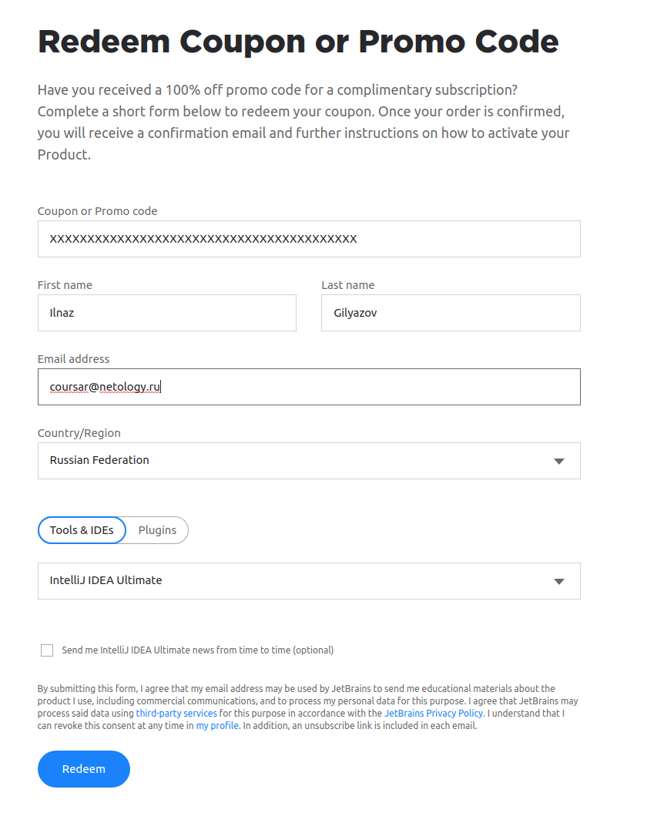
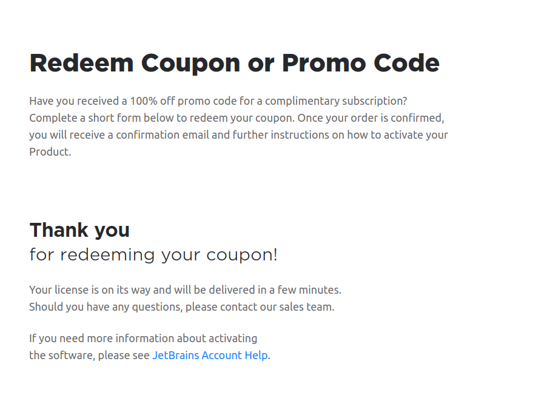
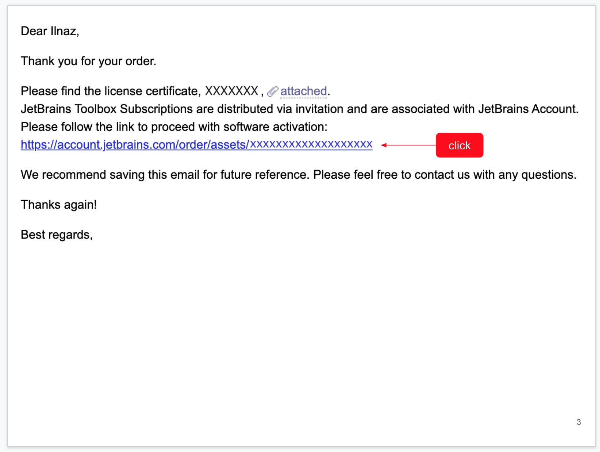
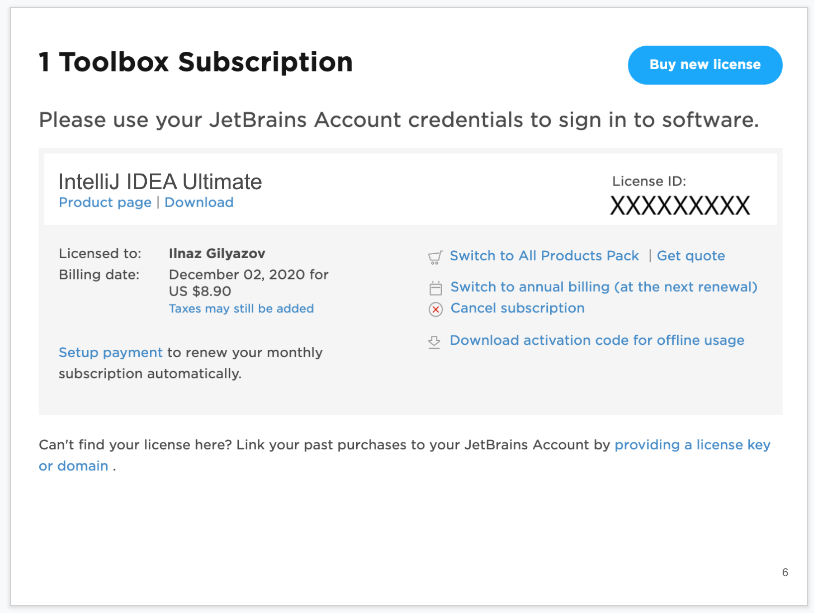
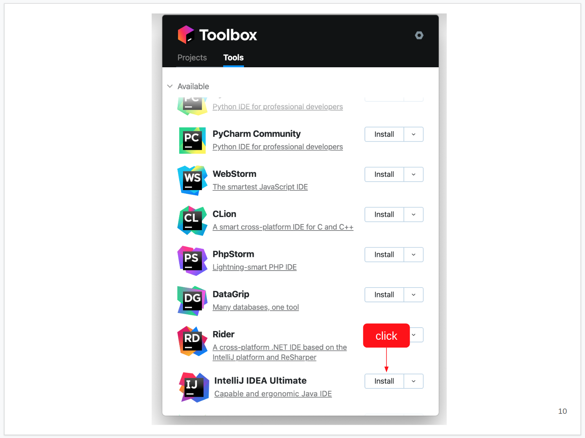
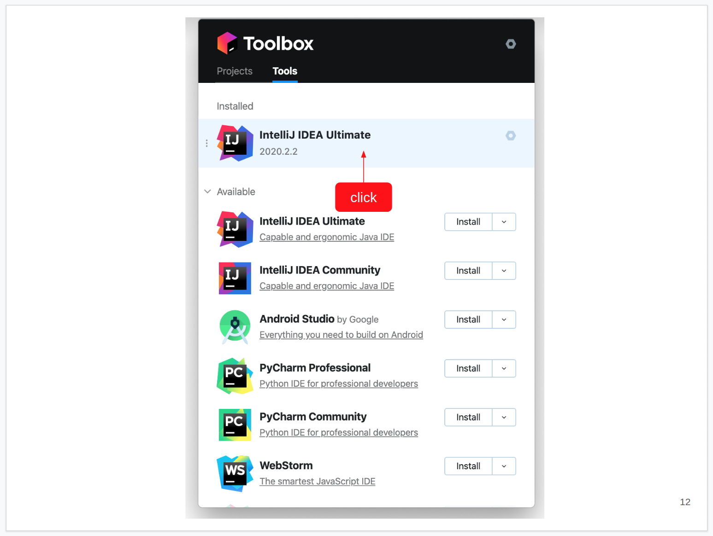
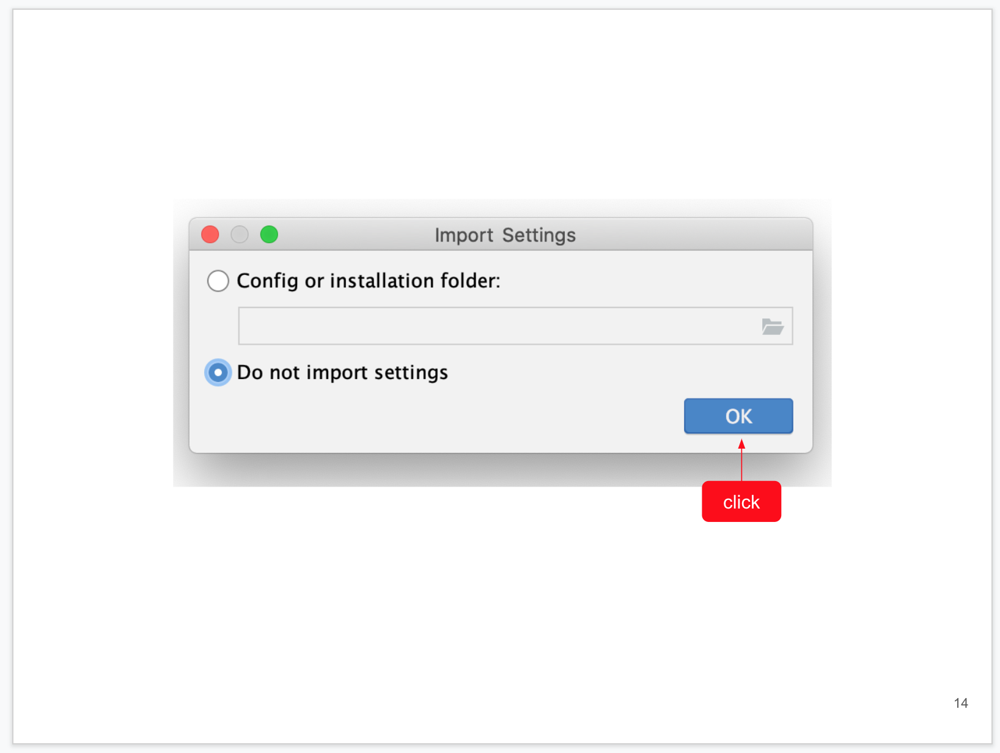
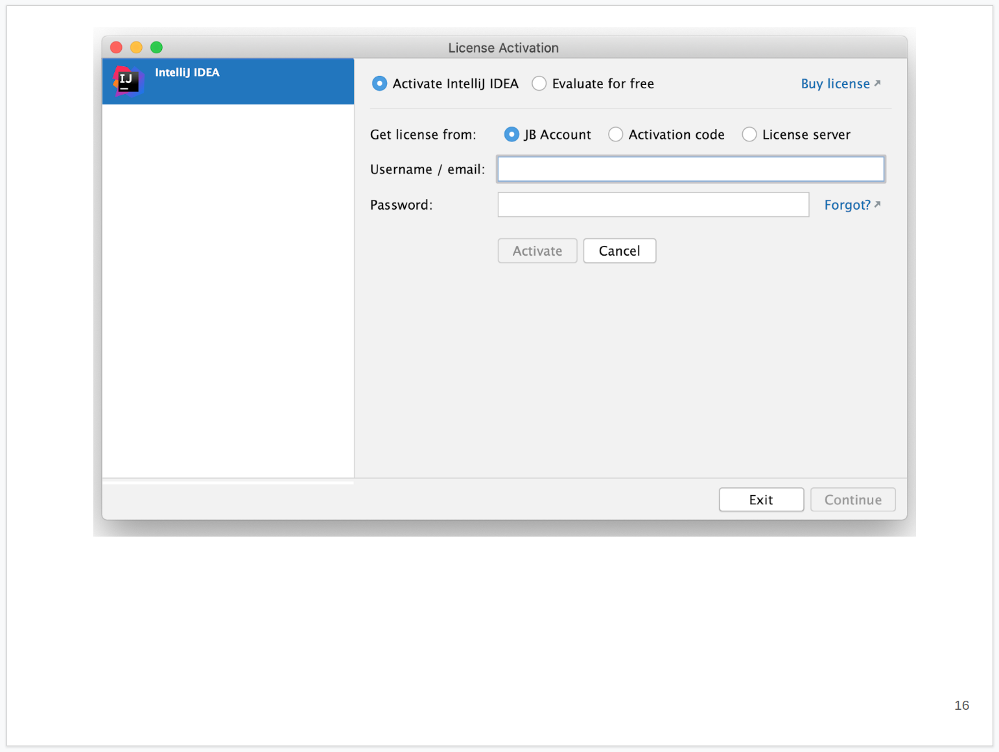

# Установка и активация IDEA Ultimate

В части курсе будет использоваться коммерческая IDE от компании JetBrains. Как студенту курса вам предоставляется купон на бесплатное использование на 6 месяцев.

**Важно**: всё абсолютно бесплатно. Не вводите нигде никаких данных карт, не скачивайте никаких активаторов и т.д.

Инструкция написана для ОС Windows, на Mac OS всё аналогично, на Linux вам нужно будет скачать архив, распаковать и запускать из него *.sh файл (остальное по аналогии).

**Важно**: если у вас что-то не получилось, напишите в Slack, на каком конкретно шаге вы застряли и что не получается.

##### Шаг 0. Обратитесь к координатору для получения номера купона

##### Шаг 1. Переходите на страницу https://www.jetbrains.com/store/redeem/ и заполняете форму:

Соответственно:

1 - ваши персональные данные и купон (вводите действующий email, он нужен будет для активации)

2 - продукт: для курсов QA нужна IDEA Ultimate

3 - отправляете форму

###### Шаг 2. При успешном заполнении формы получаете страничку:

###### Шаг 3. Переходите в свой почтовый ящик, указанный на первом шаге и ищете там письмо от JetBrains:

Переходите по ссылке из письма

###### Шаг 4. Внимательно читаете и принимаете лицензионное соглашение:

###### Шаг 5. Создаёте JetBrains аккаунт:

Все поля, кроме логина и паролей будут предзаполнены. Вам остаётся только выбрать логин, установить пароль и поставить флажки

Нажимаете на кнопку "Submit"

###### Шаг 6. Смотрите на активированную подписку:

Удостоверяетесь, что подписка оформлена на вас, на 6 месяцев. Если что-то пошло не так, пишете в саппорт JetBrains

###### Шаг 7. Переходите на сайт "JetBrains Toolbox":

JetBrains Toolbox - это удобная утилита для управления продуктами JetBrains (установка, обновление, откат к предыдущей версии)

Переходите по ссылке

###### Шаг 8. Скачиваете JetBrains Toolbox:

Выбираете вашу ОС (обычно определяется автоматически), устанавливаете и запускаете как любое другое приложение

###### Шаг 9. Принимаете User Agreement:

Внимательно читаете, соглашаетесь с лицензионным соглашением

###### Шаг 10. Устанавливаете IDEA Ultimate:

В списке продуктов находите IDEA Ultimate, нажимаете на кнопку "Install"

###### Шаг 11. Ожидание завершения установки:

Ждёте, пока всё скачается и установится

###### Шаг 12. Запускаете IDEA Ultimate:

После установки IDEA Ultimate появится в блоке "Installed", запускаете его оттуда

###### Шаг 13. Соглашаетесь/не соглашаетесь на Data Sharing:

Выбираете, отсылать статистику в JetBrains или нет

###### Шаг 14. Импортируете/не импортируете предыдущие настройки:

Если вы до этого уже использовали продукты JetBrains и хотите импортировать настройки, можете выбрать первую опцию

Мы выбираем вторую и нажимаем "OK"

###### Шаг 15. Выбираете тему:

Выбираете нужную вам тему, можете выбрать другие настройки через Next

Мы же выбираем "Skip Remaining and Set Defaults"

###### Шаг 16. Активируете:

Оставляете всё как на скриншоте, вводите только email и пароль, которые использовали при создании JetBrains Account

###### Шаг 17. Запускаете:

IDE активирована, можете работать

## Q & A

1. Если у вас что-то не получилось, присылаете номер шага и скриншот того, что не получилось
1. Купон можно активировать только один раз на один email
1. Купоны не суммируются
1. Не надо откладывать купон на "потом" (его нужно использовать до определённой даты)
1. Можно использовать учётную запись на нескольких компьютерах (например, дома и на работе)
1. Если вы выбрали и активировали купон не на тот продукт, то из личного кабинета JetBrains нужно будет писать в саппорт
