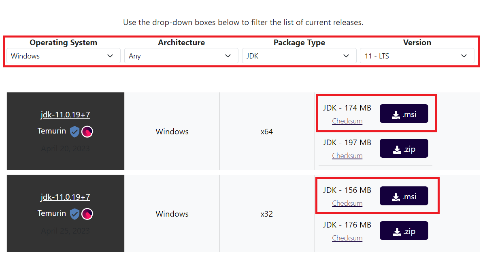
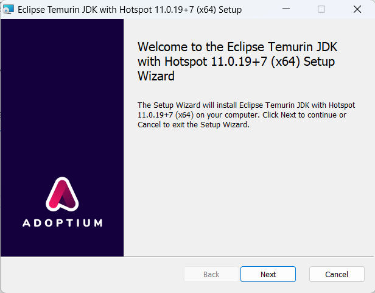
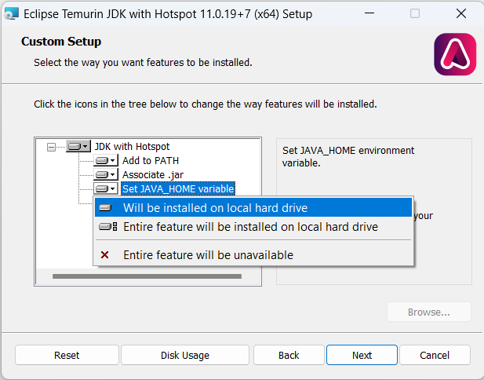
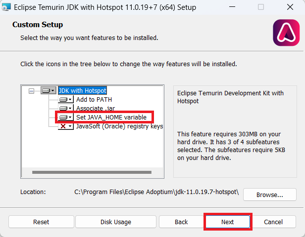
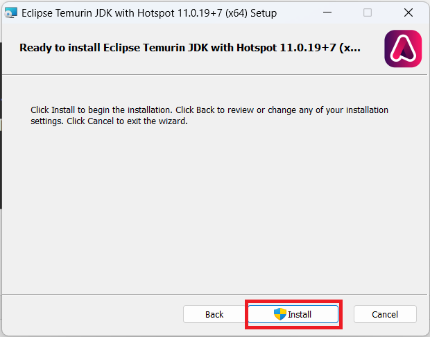
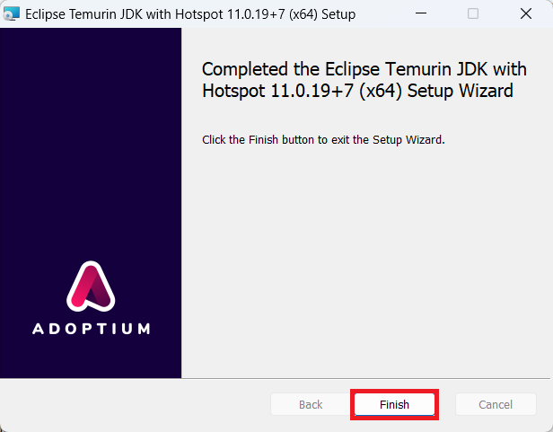
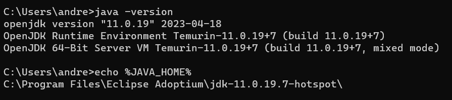

# Как установить и настроить Java Development Kit (JDK)
Студентам данного курса рекомендуется для установки JDK 11.
1. Предварительно скачайте Java Development Kit [по&nbsp;ссылке](https://adoptium.net/temurin/releases/?version=11). Выберите необходимую версию для используемой операционной системы.

2. Запустите установку:   

3. В выпадающем списке **Set JAVA_HOME variable** выберите пункт **Will be installed on local hard drive**     

      

И нажмите **Next**

       

4. Далее нажмите **Installl**   

    

и **Finish**

     

5. После выполнения указанных шагов рекомендуется перезагрузка компьютера.  

7. Чтобы проверить, успешно ли прошла установка, откройте командную строку. Для этого в меню Windows Пуск  в строке поиска введите команду cmd и нажмите Enter. После этого откроется командное окно, в котором нужно ввести следующую команды:           

- `java -version`   
- `echo %JAVA_HOME%`      

После чего, если отобразится информация об установленной версии java, а также путь к папке с уствновленной JDK, то установка прошла успешно   

       