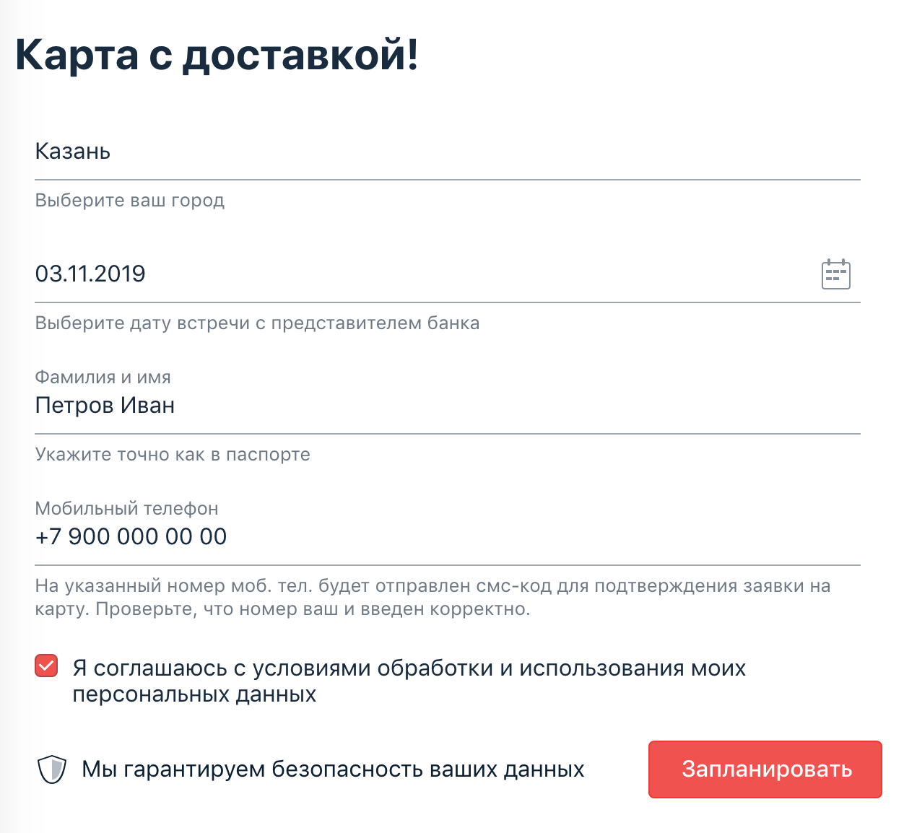

# Домашнее задание к занятию «4.1. Репортинг»

В качестве результата пришлите ссылку на ваш GitHub-проект в личном кабинете студента на сайте [netology.ru](https://netology.ru).

Все задачи этого занятия нужно делать **в одном репозитории**.

**Важно**: если у вас что-то не получилось, то оформляйте Issue [по установленным правилам](../report-requirements.md).

**Важно**: не делайте ДЗ всех занятий в одном репозитории! Иначе вам потом придётся достаточно сложно подключать системы Continuous Integration.

## Как сдавать задачи

Вы можете начасть с "чистого листа" и делать всё в пустом репозитории:

1. Инициализируйте на своём компьютере пустой Git-репозиторий
1. Добавьте в него готовый файл [.gitignore](../.gitignore)
1. Добавьте в этот же каталог код ваших авто-тестов
1. Сделайте необходимые коммиты
1. Добавьте в каталог `artifacts` целевой сервис (`app-card-delivery.jar`)
1. Создайте публичный репозиторий на GitHub и свяжите свой локальный репозиторий с удалённым
1. Сделайте пуш (удостоверьтесь, что ваш код появился на GitHub)
1. Ссылку на ваш проект отправьте в личном кабинете на сайте [netology.ru](https://netology.ru)
1. Задачи, отмеченные, как необязательные, можно не сдавать, это не повлияет на получение зачета
1. Если вы обнаружили подозрительное поведение SUT (похожее на баг), создайте описание в Issue на GitHub. [Придерживайтесь схемы при описании](../report-requirements.md).

Но мы надеемся, что вы знаете, что проекты удалять не стоит 😈, т.к. они обязательно "оживают" через какое-то время, и у вас ещё сохранился проект по Pattern'ам (а он должен был сохраниться, ведь Github и нужен для хранения всего). В этом случае вы можете просто добавить в существующий проект нужные настройки и сдавать его.

## Настройка CI
    
В данных заданиях не предполагается настройка CI. От вас требуется лишь выложить настроенные проекты на Github.

## Задача №1 - "Проснулись" (Allure)

В одном из предыдущих проектов [Patterns](https://github.com/netology-code/aqa-homeworks/tree/master/patterns) вы тестировали функциональности заказа карт.

Ваше руководство узнало на конференции, про такой замечательный инструмент, как Allure, который позволяет делать репортинг более наглядным и требует от вас интегрировать его в ваши тесты.

Начать решили именно с функции доставки карт:

Вам нужно: взять ваш проект (см. "Как сдавать задачи") и прикрутить туда Allure, интегрированный с Selenide. Удостоверьтесь, что при локальном запуске всё работает, отчёты генерируются, скриншоты прикрепляются и вы можете их посмотреть через Allure.

## Задача №2 - Report Portal (необязательная)

Мы сразу предупреждаем, что это задача может оказаться очень сложной, т.к. мы вас поставим в такие условия, когда "разбираться придётся самим". Будьте готовы к этому и в работе, т.к. такое обязательно может случиться - кто-то примет решение попробовать использовать определённую технологию, а разбираться, настраивать и устанавливать всё придётся вам самим. Кроме того, что нужно будет разобраться, нужно будет ещё и "задокументировать это для будущих поколений", чтобы они не тратили столько же времени, сколько потратите вы.

При этом вы должны понимать, что в отличие от материалов курса, которые проверены авторами курса, информация, содержащаяся в онлайн-источниках, может быть неполной, устаревшей и даже ошибочной.

Что нужно сделать: нужно попробовать интегрировать ваш проект тестирования доставки карт с Report Portal. Нам будет достаточно, если логи вашего теста будут отправляться в запущенный экземпляр Report Portal.

Как это сделать - у вас есть несколько ссылок, с которых следует начать поиск:
* https://reportportal.io/
* https://github.com/reportportal

В результате: обновляете ваш проект на Github для интеграции с Report Portal и выкладываете краткий Manual в виде README.md, в котором описываете необходимые действия для воспроизведения вашей интеграции.

   
Подсказка

   1. Достаточно часто разработчики решений предоставляют готовые Docker-файлы и даже docker-compose.yml, для того, чтобы вы могли "быстро развернуть" сервис и попробовать его в действии. 
   1. Часто такое бывает, что в официальном репо на Github выкладываются примеры интеграции. Возможно, стоит посмотреть там (по стеку используемых вами технологий: как минимум, JUnit5).

