# Инструкция по работе с Volumes для Docker и Docker Toolbox

## Volumes

Volumes - механизм, позволяющий "пробрасывать" каталоги в контейнер. Т.е. буквально вы можете подключить каталог с вашего компьютера к каталогу в контейнере.


Изображение с сайта https://docs.docker.com.

Прежде чем разбираться, как это делать, вам нужно понять, что и зачем вам вообще подключать в `volumes`. 

Например, есть такой HTTP-сервер [nginx](https://nginx.org/ru/)*. Его задача - обслуживание HTTP-запросов.

Примечание:* на самом деле, это не только http-сервер, но ещё и куча всего, но пока нам это мало интересно.

Самый простой пример: вы вбиваете в адресную строку браузера URL, веб-сервер вам отдаёт страницу, которая и отображается браузером.

Чтобы веб-сервер мог отдать какую-то страницу, она у него должна быть.

Вот код нашей страницы (скопируйте и сохраните его в файле `index.html`).

```html
<!doctype html>
<html lang="en">
<head>
<meta charset="UTF-8">
<meta name="viewport" content="width=device-width, user-scalable=no, initial-scale=1.0, maximum-scale=1.0, minimum-scale=1.0">
<meta http-equiv="X-UA-Compatible" content="ie=edge">
<title>Hello Docker!</title>
</head>
<body>
  <h1>Hello Docker!</h1>
</body>
</html>
```

В "тяжёлом" случае, мы можем создать простую html-страницу (вы это делали в курсе по git), скачать/установить nginx и настроить его... Но зачем? Есть же Docker.

Идём на Docker Hub и забиваем nginx:

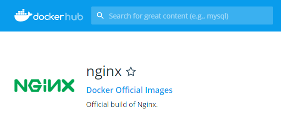

Но nginx'у же нужно как-то отдать нашу страницу? Вот тут на помощь и приходят Volumes - мы можем положить нашу страницу в каталог на локальный диск и "скормить" её контейнеру в виде Volume.

На странице конкретного образа написано, какие Volumes и как рекомендуется подключать:

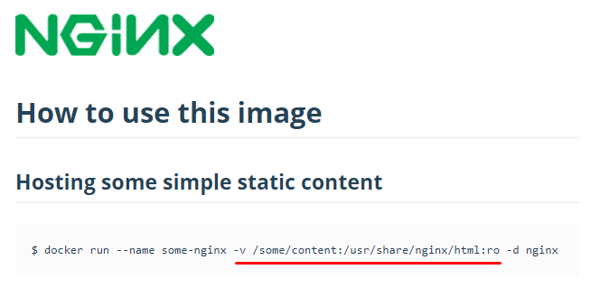

Т.е. флаг `-v` дальше пишется локальный путь, после чего пишется путь внутри контейнера (он обычно указывается в документацию на контейнер).

К сожалению (а может, и к счастью), в документации на образы пишутся примеры только для Unix-подобных систем, т.е. в них путь указывается как `/path/to/directory`, поэтому в следующих разделах мы разберёмся как это делать.

## Инициализация контейнеров

Многие образа на своих страницах предлагают использовать специальный каталог для начальной инициализации (т.е. если туда положить файлы нужного формата, то база данных при старте их будет считывать).

MySQL:

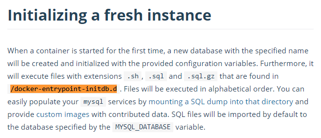

Postgres:

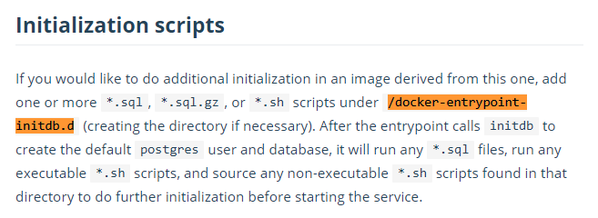

Mongo:

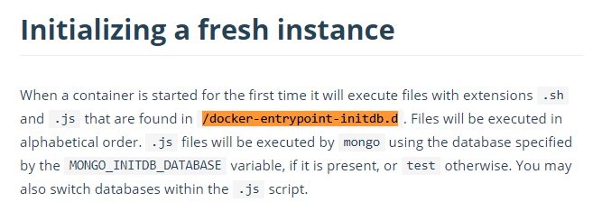

## Docker Toolbox (Windows)

Если вы счастливый обладатель Docker Toolbox на Windows, то вам придётся немного понастраивать систему.

Что нужно сделать:

1. Откройте VirtualBox:

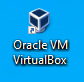

2. Выберите машину `default` и нажмите на кнопку настроить:

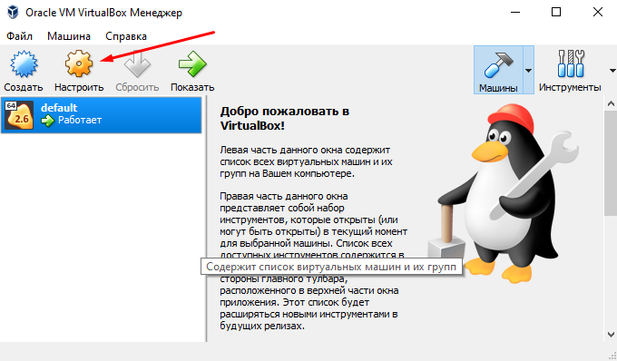

3. Выберите опцию `Общие папки` и убедитесь, что настройки там такие же, как на скриншоте (если нет, то кликните два раза и поправьте):

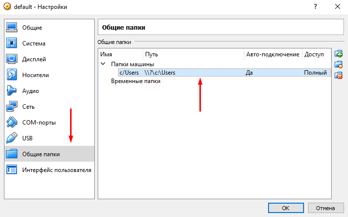

4. Если вы поменяли на предыдущем шаге настройки, то после этого щёлкните на машине `default` правой кнопкой мыши и выберите `Перезапустить`:

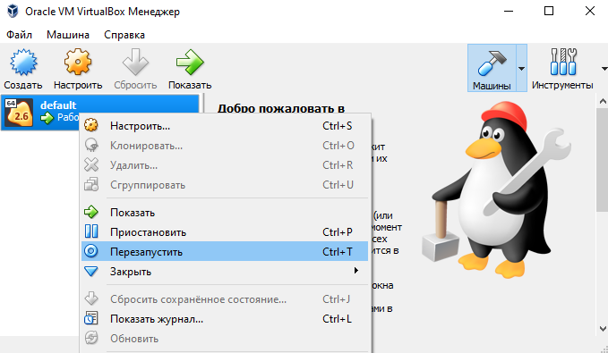

Важно: Docker будет подключать только каталоги из `C:\Users`, поэтому мы рекомендуем вам в папке вашего пользователся создать каталог `projects` и работать там.

Открываете ваш проект в IDEA и вводите в консоли (`Alt + F12`):

```
docker container run --name demo-nginx -p 8080:80 -v /c/Users/admin/projects/html:/usr/share/nginx/html:ro -d nginx
```

Обратите внимание, что `Users` было написано с большой буквы.

## Docker Compose

В обоих случаях с Docker Compose ситуация будет следующая (для Docker Toolbox важно, чтобы ваш проект находился в одном из подкаталогов `C:\Users`):

```
version: '3'
services:
  http:
    image: nginx:latest
    ports:
      - 8080:80
    volumes:
    - ./html:/usr/share/nginx/html:ro
```

И в консоли запускаете `docker-compose up`

## Docker Compose и плагин IDEA (для Docker Toolbox и Windows)

Если вы хотите использовать Plugin для IDEA и при запуске получаете вот такую картину:

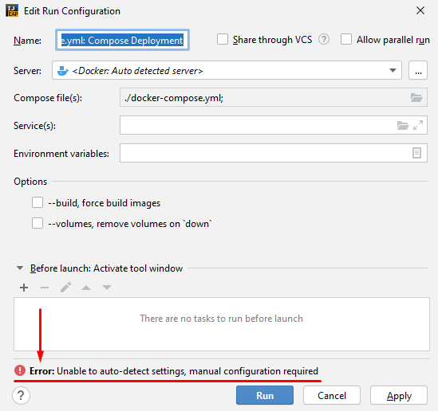

То вам нужно щёлкнуть на кнопке с тремя точками:

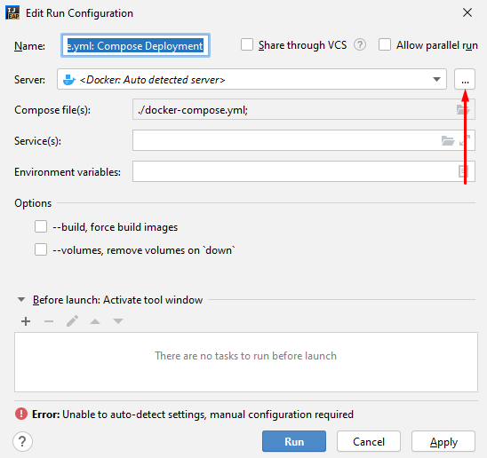

И заменить `tcp` на `https`:

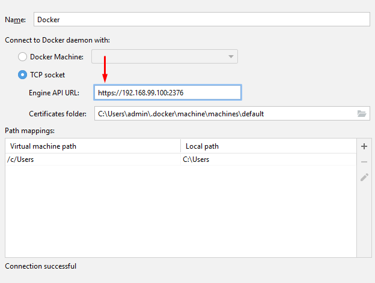

После чего удостовериться, что `docker-compose.yml` по-прежнему выбран (если слетел, то выберите его руками):

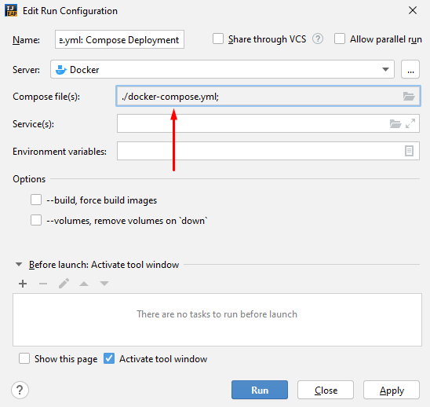

После этого активируется панелька `Services`, в которой вы и сможете всё настроить:


