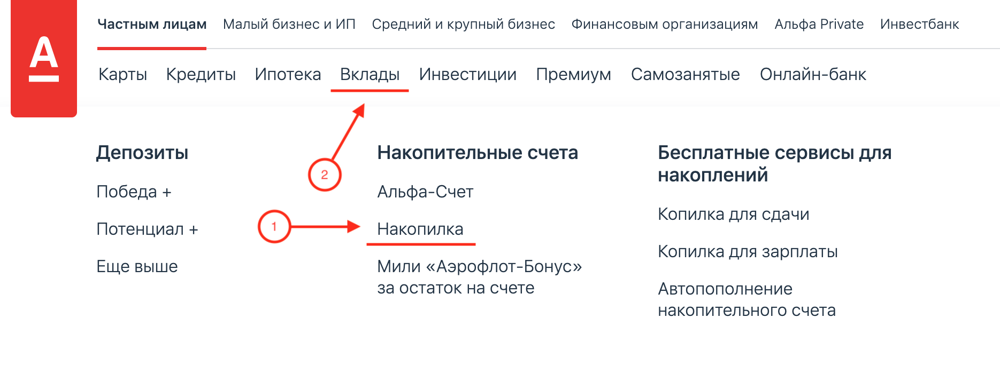
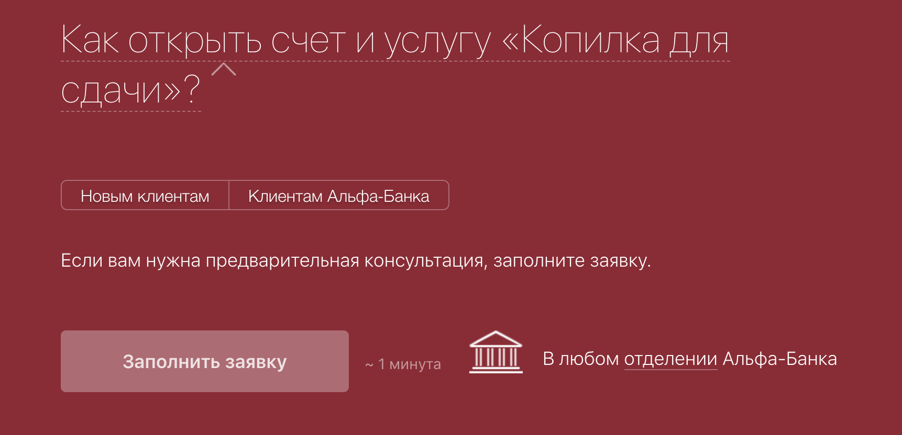
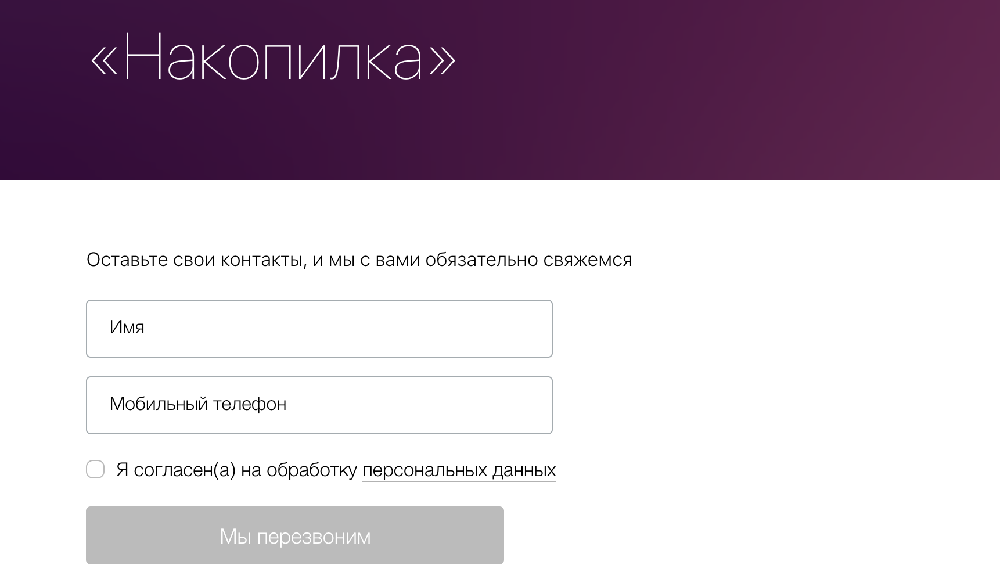
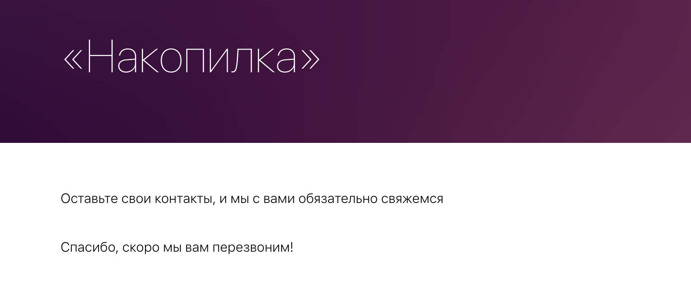

# Домашнее задание к занятию «4.2. Заключительная лекция»

В качестве результата пришлите ссылку на ваш GitHub-проект в личном кабинете студента на сайте [netology.ru](https://netology.ru).

В рамках этого ДЗ нужно сделать только одну задачу (она является обязательной).

## Как сдавать задачи

1. Инициализируйте на своём компьютере пустой Git-репозиторий
1. Добавьте в него готовый файл [.gitignore](../.gitignore)
1. Добавьте в этот же каталог файл README.md с описанием вашего плана тестирования
1. Сделайте необходимые коммиты
1. Создайте публичный репозиторий на GitHub и свяжите свой локальный репозиторий с удалённым
1. Сделайте пуш (удостоверьтесь, что ваш код появился на GitHub)
1. Ссылку на ваш проект отправьте в личном кабинете на сайте [netology.ru](https://netology.ru)

### Внедрение автоматизации

Поскольку у вас уже есть опыт в автоматизации, неплохо бы начать учиться планировать.

Важно: у вас нет разрешения на тестирование и автоматизацию. Поэтому вы не должны тестировать и автоматизировать, вы должны только **составить план**.

Что вам нужно сделать: вам нужно внимательно изучить [веб-сайт Альфа-Банка](https://alfabank.ru).

Что мы схотим запланировать: мы хотим запланировать тестирования возможности открытия вклада "Накопилка":

Попасть на страницу этого вклада можно из меню "Частным лицам" - "Накопилка" (п.1).

Но представители банка сказали вам, что чаще на страницу вклада попадают через меню "Вклады" (п.2).

На странице вклада есть несколько кнопок, позволяющих попасть на страницу заявки:

Представители банка говорят, что частота перехода по обеим кнопкам примерно одинакова.

После нажатия на кнопку пользователь должен попасть на страницу анкеты:

Процедура отправки анкеты заканчивается на этапе заполнения контактов:

Что нужно сделать: нам нужен от вас план автоматизации тестирования сценария отправки заявки на именно этот вклад (начиная с захода на главную страницу).

Что должно быть в плане:
1. Перечень автоматизируемых сценариев
1. Перечень используемых инструментов с обоснованием выбора
1. Перечень необходимых разрешений/данных/доступов от банка (предоставлять доступ к СУБД или давать собранную версию сервиса, вам, естественно, не будут)
1. Перечень и описание возможных рисков при автоматизации
1. Перечень необходимых специалистов для автоматизации
1. Интервальная оценка с учётом рисков (в часах)

Формат плана - свободный, но количество разделов должно соответствовать списку и документ должен быть оформлен как документ: аккуратно, по всем правилам.

Напоминаем ещё раз: у вас нет разрешения на тестирование и автоматизацию. Поэтому вы не должны тестировать и автоматизировать, вы должны только **составить план**.