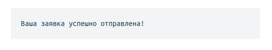

# Домашнее задание к занятию «2.1. Тестирование веб-интерфейсов»

В качестве результата пришлите ссылку на ваш GitHub-проект в личном кабинете студента на сайте [netology.ru](https://netology.ru).

Все задачи этого занятия нужно делать в одном репозитории.

**Важно**: если у вас что-то не получилось, то оформляйте Issue [по установленным правилам](../report-requirements.md).

**Важно**: не делайте ДЗ всех занятий в одном репозитории! Иначе вам потом придётся достаточно сложно подключать системы Continuous Integration.

## Как сдавать задачи

1. Инициализируйте на своём компьютере пустой Git-репозиторий
1. Добавьте в него готовый файл [.gitignore](../.gitignore)
1. Добавьте в этот же каталог код ваших авто-тестов
1. Сделайте необходимые коммиты
1. Добавьте в каталог `artifacts` целевой сервис ([`app-order.jar`](app-order.jar) - см. раздел Настройка CI)
1. Создайте публичный репозиторий на GitHub и свяжите свой локальный репозиторий с удалённым
1. Сделайте пуш (удостоверьтесь, что ваш код появился на GitHub)
1. Удостоверьтесь, что на Appveyor сборка зелёная
1. Поставьте бейджик сборки вашего проекта в файл README.md
1. Ссылку на ваш проект отправьте в личном кабинете на сайте [netology.ru](https://netology.ru)
1. Задачи, отмеченные, как необязательные, можно не сдавать, это не повлияет на получение зачета

## Настройка CI
    
### Общее описание

Общая схема работы выглядит следующим образом: CI должен запустить целевой сервис в фоновом режиме (который вы и тестируете) и ваши авто-тесты. Для этого мы будем на этот раз использовать возможности PowerShell (для этого Appveyor требует писать префикс `ps:` перед командами).

Детальнее с PowerShell вы можете ознакомиться [на официальном разделе сайта Microsoft](https://docs.microsoft.com/en-us/powershell/).

Для того, чтобы запустить целевой сервис есть несколько вариантов, самый простой из которых - положить jar-файл прямо в ваш репозиторий. Когда Appveyor будет выкачивать исходники авто-тестов, он выкачает и ваш сервис. Конечно, вы должны понимать, что в реальной жизни артифакты (собранный целевой сервис) хранятся в специальных системах и процесс выкачивания будет зависеть от того, где и как хранится артефакт.

Далее расписан пошаговый процесс настройки CI.

### 1. Целевой сервис

Ваш целевой сервис (SUT - System under test), расположен в файле `app-order.jar` (в этом репозитории). Вам нужно его скачать и положить в каталог `artifacts` вашего проекта.

Поскольку файлы с расширением `.jar` находят в списках `.gitignore` вам нужно принудительно заставить git следить за ним: `git add -f artifacts/app-order.jar`.

После чего сделать `git push`. Обязательно удостоверьтесь, что файл попал в репозиторий.

### 2. `build.gradle`

Ваш `build.gradle` должен выглядеть следующим образом:

```groovy
plugins {
    id 'java'
}

group 'ru.netology'
version '1.0-SNAPSHOT'

sourceCompatibility = 1.8

// кодировка файлов (если используете русский язык в файлах)
compileJava.options.encoding = "UTF-8"
compileTestJava.options.encoding = "UTF-8"

repositories {
    mavenCentral()
}

dependencies {
    testImplementation 'org.junit.jupiter:junit-jupiter:5.5.1'
    testImplementation 'com.codeborne:selenide:5.3.1'
}

test {
    useJUnitPlatform()
    // в тестах, вызывая `gradlew test -Dselenide.headless=true` будем передавать этот параметр в JVM (где его подтянет Selenide)
    systemProperty 'selenide.headless', System.getProperty('selenide.headless')
}
```

На серверах сборки чаще всего нет графического интерфейса, поэтому запуская браузер в этом режиме мы не требуем графического интерфейса (при этот все алгоритмы продолжают работать).

Детальнее можете почитать про Headless:
- [Chrome](https://www.chromestatus.com/features/5678767817097216)
- [Gecko (Firefox)](https://developer.mozilla.org/en-US/docs/Mozilla/Firefox/Headless_mode)

### 3. `appveyor.yml`

На этот раз мы воспользуемся возможностями оболочки Powershell. Ключевая проблема состоит в следующем: когда мы запускаем наши авто-тесты, SUT уже должен быть запущен, поэтому мы поступим следующим образом: сразу после `git clone` запустим SUT, а после завершения всех тестов - остановим:

```yml
image: Ubuntu1804  # образ для сборки

branches:
  only:
    - master  # ветка git

build: off  # будем использовать свой скрипт сборки

install:
  # запускаем SUT (запоминаем информацию о процессе в переменной $App)
  - ps: $App = Start-Process -FilePath java -ArgumentList "-jar ./artifacts/app-order.jar" -PassThru

build_script:
  - ps: ./gradlew test --info "-Dselenide.headless=true"  # стартуем Selenide в Headless-режиме (см.ниже)

on_finish:
  - ps: Stop-Process -Id $App.Id  # оставливаем SUT
```

[Подробное описание `Start-Process`](https://docs.microsoft.com/en-us/powershell/module/microsoft.powershell.management/start-process)

Естественно, у вас должен возникнуть вопрос, а что будет, если SUT не успеет стартовать к моменту запуска авто-тестов?

Тогда ваши тесты упадут. Что с этим делать и как классифицировать подобные случаи, мы поговорим на следующих лекциях.

## Задача №1 - Заказ карты

Вам необходимо автоматизировать тестирование формы заказа карты:


Требования к содержимому полей:
1. Поле Фамилия и имя - разрешены только русские буквы, дефисы и пробелы.
2. Поле телефон - только цифры (11 цифр), символ + (на первом месте).
3. Флажок согласия должен быть выставлен.

Тестируемая функциональность: отправка формы.

Условия: если все поля заполнены корректно, то вы получаете сообщение об успешно отправленной заявке:



Вам необходимо самостоятельно изучить элементы на странице, чтобы подобрать правильные селекторы.

<details>
    <summary>Подсказка</summary>

    Смотрите на `data-test-id` и внутри него ищите нужный вам `input` - используйте вложенность для селекторов.
</details>

Проект с авто-тестами должен быть выполнен на базе Gradle, с использованием Selenide.

Для запуска тестируемого приложения скачайте jar-файл из текущего каталога и запускайте его командой:
`java -jar app-order.jar`

Приложение будет запущено на порту 9999.

Если по каким-то причинам порт 9999 на вашей машине используется другим приложением, используйте:

`java -jar app-order.jar -port=7777`

Убедиться, что приложение работает, вы можете открыв в браузере страницу: http://localhost:9999

## Задача №2 - Проверка валидации (необязательная)

После того, как вы протестировали Happy Path, необходимо протестировать остальные варианты.

Тестируемая функциональность: валидация полей перед отправкой.

Условия: если какое-то поле не заполнено, или заполнено неверно, то при нажатии на кнопку "Продолжить" должны появляться сообщения об ошибке (будет подсвечено только первое неправильно заполненное поле):


<details>
    <summary>Подсказка</summary>

    У некоторых элементов на странице появится css-класс `input_invalid`.
</details>
