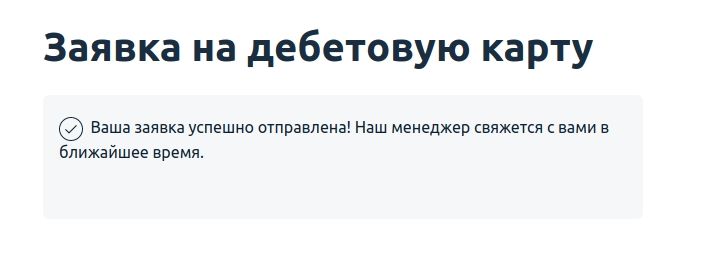
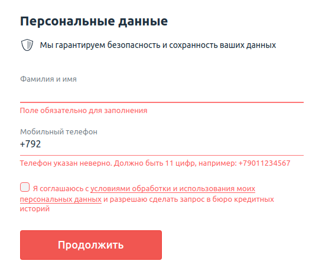

# Домашнее задание к занятию «2.1. Тестирование веб-интерфейсов»

В качестве результата пришлите ссылку на ваш GitHub-проект в личном кабинете студента на сайте [netology.ru](https://netology.ru).

Все задачи этого занятия нужно делать в одном репозитории.

[Примеры кода к занятию](https://github.com/netology-code/aqa-code/tree/master/web).

**Важно**: если у вас что-то не получилось, то оформляйте issue [по установленным правилам](../report-requirements.md).

**Важно**: не делайте ДЗ всех занятий в одном репозитории. Иначе вам потом придётся достаточно сложно подключать системы Continuous integration.

## Как сдавать задачи

1. Инициализируйте на своём компьютере пустой Git-репозиторий.
1. Добавьте в него готовый файл [.gitignore](../.gitignore).
1. Добавьте в этот же каталог код ваших автотестов.
1. Сделайте необходимые коммиты.
1. Добавьте в каталог `artifacts` целевой сервис [app-order.jar](app-order.jar).
1. Создайте публичный репозиторий на GitHub и свяжите свой локальный репозиторий с удалённым.
1. Сделайте пуш — удостоверьтесь, что ваш код появился на GitHub.
1. Выполните интеграцию проекта с Github Actions ([инструкция](../github-actions-integration)) или Appveyor ([инструкция](https://github.com/netology-code/aqa-homeworks/tree/master/api-ci#appveyor)) на выбор, удостоверьтесь что автотесты в CI выполняются.             
1. Поставьте бейджик сборки вашего проекта в файл README.md.
1. Ссылку на ваш проект отправьте в личном кабинете на сайте [netology.ru](https://netology.ru).
1. Задачи, отмеченные как необязательные, можно не сдавать, это не повлияет на получение зачёта.     
1. Автотесты могут падать и сборка может быть красной из-за багов тестируемого приложения. В таком случае должны быть заведены репорты на обнаруженные в ходе тестирования дефекты в отдельных issues, [придерживайтесь схемы при описании](../report-requirements.md).

## Селекторы

Перед выполнением ДЗ рекомендуем вам ознакомиться с [кратким руководством по работе с селекторами](selectors.md).

## Настройка

### 1. Целевой сервис

Ваш целевой сервис (SUT — System under test) расположен в файле `app-order.jar` в этом репозитории. Вам нужно его скачать и положить в каталог `artifacts` вашего проекта.

Поскольку файлы с расширением `.jar` находят в списках `.gitignore`, вам нужно принудительно заставить Git следить за ним: `git add -f artifacts/app-order.jar`.

После чего сделать `git push`. Обязательно удостоверьтесь, что файл попал в репозиторий.

### 2. `build.gradle`

Файл `build.gradle` в проектах на базе Selenium и Selenide должен выглядеть следующим образом:

```groovy
plugins {
    id 'java'
}

group 'ru.netology'
version '1.0-SNAPSHOT'

sourceCompatibility = 11

// кодировка файлов (если используете русский язык в файлах)
compileJava.options.encoding = "UTF-8"
compileTestJava.options.encoding = "UTF-8"

repositories {
    mavenCentral()
}

dependencies {
    testImplementation 'org.junit.jupiter:junit-jupiter:5.6.1'
    // библиотека com.codeborne:selenide используется при построении проекта с использованием Selenide
    // testImplementation 'com.codeborne:selenide:6.17.2'
    
    // при реализации проекте с использованием Selenium вместо библиотеки com.codeborne:selenide подключаются
    // org.seleniumhq.selenium:selenium-java и io.github.bonigarcia:webdrivermanager
     testImplementation 'org.seleniumhq.selenium:selenium-java:4.18.1'
     testImplementation 'io.github.bonigarcia:webdrivermanager:5.7.0'
}

test {
    useJUnitPlatform()
    // в тестах, вызывая `gradlew test -Dselenide.headless=true` будем передавать этот параметр в JVM (где его подтянет Selenide)
    // свойство selenide.headless используется в проектах на основе Selenide для передачи значения параметра в JVM
    systemProperty 'selenide.headless', System.getProperty('selenide.headless')
    // свойство chromeoptions.prefs используется для задания настроек браузера в проектах на основе Selenide, выключаем менеджер паролей 
    systemProperty 'chromeoptions.prefs', System.getProperty('chromeoptions.prefs', "profile.password_manager_leak_detection=false")
}
```

#### **Headless-режим браузера**

На серверах сборки чаще всего нет графического интерфейса, поэтому, запуская браузер в режиме **headless**, мы отключаем графический интерфейс. При этом все процессы браузера продолжают работать так же.
При использовании **Selenium** этот режим настраивается непосредственно в коде во время инициализации драйвера, примеры инициализации ниже.

Детальнее можете почитать про headless:
- [Chrome](https://www.chromestatus.com/features/5678767817097216),
- [Gecko (Firefox)](https://hacks.mozilla.org/2017/12/using-headless-mode-in-firefox/).

Включение **headless**-режима при использовании **Selenium** необходимо реализовать в коде во время создания экземпляра WebDriver:

```java
ChromeOptions options = new ChromeOptions();
options.addArguments("--disable-dev-shm-usage");
options.addArguments("--no-sandbox");
options.addArguments("--headless");
driver = new ChromeDriver(options);
```

Для **Selenide** **headless**-режим активируется при запуске тестов с определённым параметром:
```
./gradlew clean test -Dselenide.headless=true
```

#### **WebDriver для разных операционных систем**

Если вы выполняете работу с использованием **Selenium**, то будьте готовы, что ваша сборка может упасть из-за того, что у вас в репозитории WebDriver для одной ОС, например, для Windows, а в CI используется Linux. Для решения этой проблемы можно использовать библиотеку [Webdriver Manager](https://github.com/bonigarcia/webdrivermanager). Она автоматически определяет ОС и версию браузера, скачивает и устанавливает подходящий файл драйвера. Кстати, в Selenide используется именно эта библиотека.
Для автоматической настройки хромдрайвера с помощью **Webdriver Manager** в проектах на основе **Selenium** добавьте в тестовый класс метод
```java
@BeforeAll
public static void setupAll() {
    WebDriverManager.chromedriver().setup();
}
```
При использовани **Webdriver Manager** отпадает необходимость в хранении файлов вебдрайвера в репозитории проекта и задании значения свойства **webdriver.chrome.driver** вручную.

### 3. `.appveyor.yml`

AppVeyor настраивается аналогично предыдущей лекции, за исключением того, что тесты нужно запускать так, чтобы **Selenide** запускался в headless-режиме.    
Секция `build_script` для включения headless режима в проекте, построенном с использованием **Selenide**, будет выглядеть так
```yaml
build_script:
  - ./gradlew test --info -Dselenide.headless=true
```
Если тесты написаны с использованием **Selenium**, то после включения headless-режима в коде никаких дополнительных флагов в командной строке передавать не нужно.

## Задача №1: заказ карты

Вам необходимо автоматизировать тестирование формы заказа карты:


Требования к содержимому полей:
1. В поле фамилии и имени разрешены только русские буквы, дефисы и пробелы.
2. В поле телефона — только 11 цифр, символ + на первом месте.
3. Флажок согласия должен быть выставлен.

Тестируемая функциональность: отправка формы.

Условия: если все поля заполнены корректно, то вы получаете сообщение об успешно отправленной заявке:



Вам необходимо самостоятельно изучить элементы на странице, чтобы подобрать правильные селекторы.

<details>
    <summary>Подсказка</summary>

    Смотрите на `data-test-id` и внутри него ищите нужный вам `input` — используйте вложенность для селекторов.
</details>

Проект с автотестами должен быть выполнен на базе Gradle с использованием Selenide или Selenium по выбору студента.

Для запуска тестируемого приложения, находясь в корне проекта, выполните в терминале команду:
`java -jar ./artifacts/app-order.jar`

Приложение будет запущено на порту 9999.

Убедиться, что приложение работает, вы можете, открыв в браузере страницу: http://localhost:9999

Если по каким-то причинам порт 9999 на вашей машине используется другим приложением, используйте:

`java -jar app-order.jar -port=7777`

## Задача №2: проверка валидации (необязательная)

После того как вы протестировали happy path, необходимо протестировать остальные варианты.

Тестируемая функциональность: валидация полей перед отправкой.

Условия: если какое-то поле не заполнено или заполнено неверно, то при нажатии на кнопку «Продолжить» должны появляться сообщения об ошибке. Будет подсвечено только первое неправильно заполненное поле:



<details>
    <summary>Подсказка</summary>

    У некоторых элементов на странице появится css-класс `input_invalid`.
</details>

