# CSS Selectors

[CSS селекторы](https://www.w3.org/TR/selectors-3/) – это специальные выражения, которые позволяют вам выбирать элементы на html-странице*.

Примечание*: на самом деле, не только на html-странице, но нас будет интересовать только страница.

Селекторов достаточно много, мы рассмотрим те, которыми вы будете пользоваться чаще всего. Итак, начнём.

## Документ

Смотреть всё мы будем на вот таком документе:

```html
<!doctype html>
<html lang="en">
<head>
  <meta charset="UTF-8">
  <meta name="viewport"
        content="width=device-width, user-scalable=no, initial-scale=1.0, maximum-scale=1.0, minimum-scale=1.0">
  <meta http-equiv="X-UA-Compatible" content="ie=edge">
  <title>Document</title>
</head>
<body>
  <h1 class="title">Netology Banking!</h1>
  <form data-form="feedback">
    <input id="input-name" name="name" data-input="name" />
    <textarea id="input-message" name="message" data-input="message"></textarea>
    <button>Send</button>
  </form>
  <footer>
    <p>&copy; Netology 2020</p>
    <form action="">
      <input type="search" placeholder="Search">
    </form>
  </footer>
</body>
</html>
```

Для работы нам понадобится открыть эту страницу в браузере (воспользуйтесь адресом https://netology-code.github.io/aqa-homeworks/selectors.html).

Откройте Developer Tools (Ctrl + Shift + I либо F12) и перейдите на вкладку Elements:

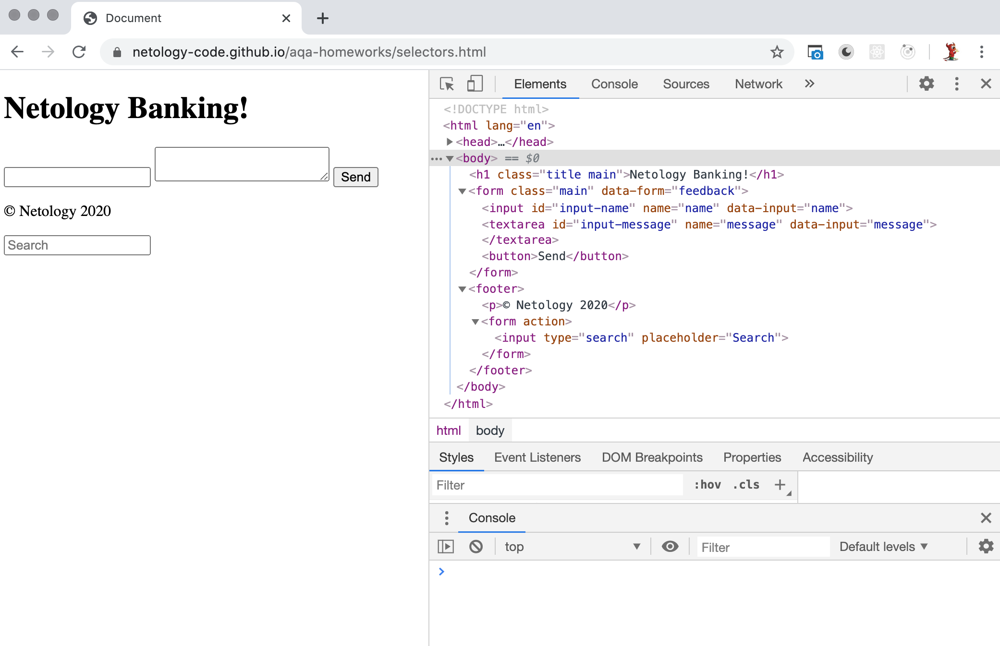

Раскройте все элементы внутри `body` (нажимая на треугольник):

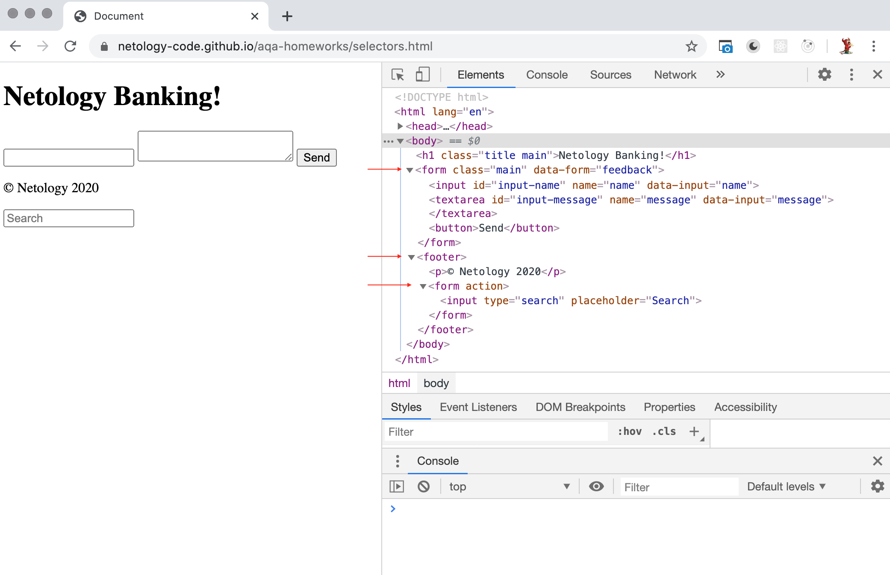

Убедитесь, что у вас показывается внизу панелька Console:


Если вдруг она не показана, то перейдите в меню (1) и выберите Show console drawer (2):

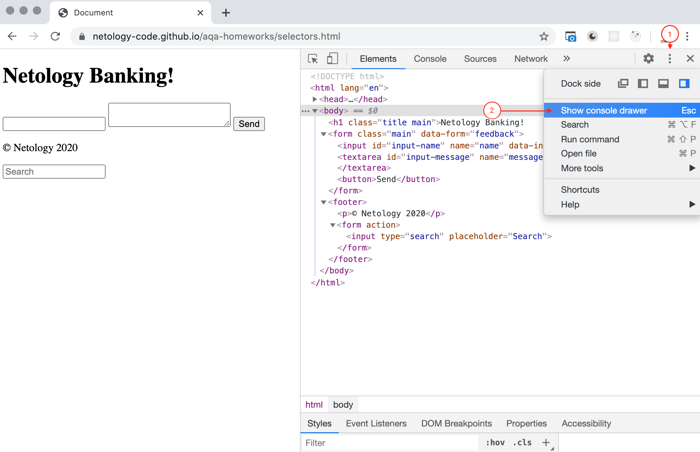

Теперь рассмотрим ключевые селекторы:
1. По тегу
1. По id
1. По классу
1. По атрибуту

А так же, чуть позже, комбинированные селекторы.

### "Simple" селекторы

#### Селектор по тегу

Селектор по тегу представляет из себя название того тега, элемент которого вы ищете.

Например, для `<input>` селектор будет `input` (т.е. угловые скобки писать не нужно, атрибуты тоже).

Чтобы посмотреть, как это работает, поставьте курсор в консоль и используйте две функции:
* `$$('selector')` - для поиска всех элементов, соответствующих селектору
* `$('selector)` - для поиска первого элемента (поиск осуществляется сверху вниз с заходом во все дочерние элементы)

По мере ввода (1) вам сразу будут показывать превью (2) результата:
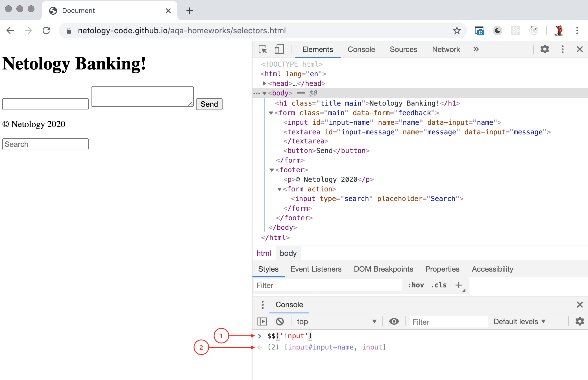

Обратите внимание, что мы ещё не нажали Enter.

После нажатия на Enter браузер найдёт все элементы и покажет вам в виде списка (массива), который можно так же по стрелке раскрыть:
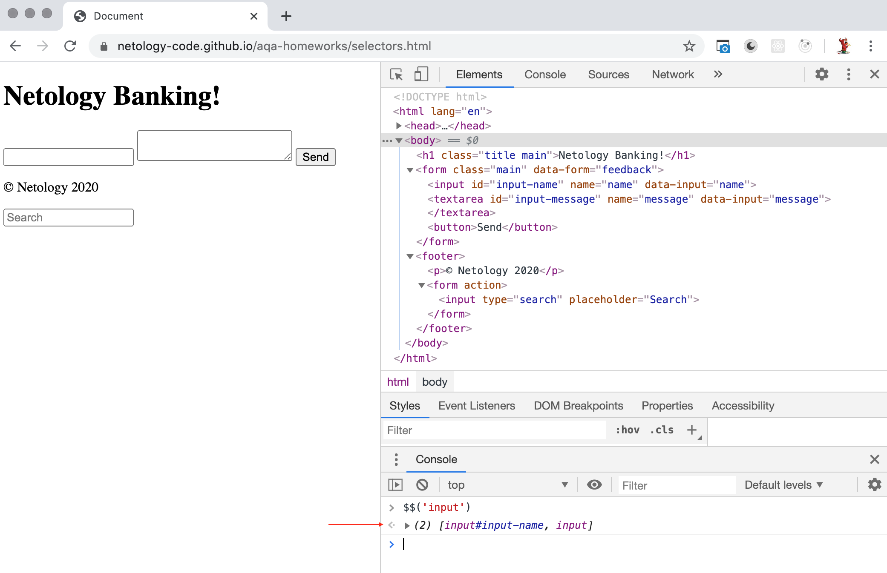

Теперь, если вы раскроете список элементов и кликните на первом элементе (не на индексе), а на самом элементе, то браузер подсветит вам этот элемент на странице (1) и в дереве элементов (2):
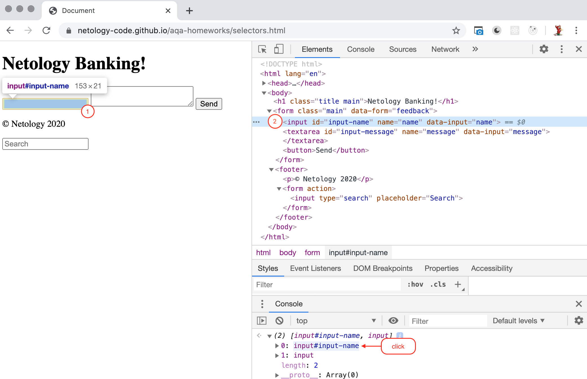

То же самое, со вторым элементом:
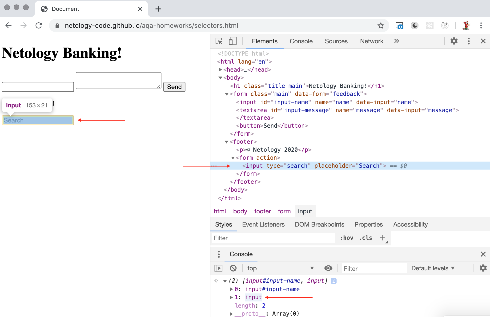

Как вы видите, второй найденный элемент оказался ниже в деревере элементов, чем первый. Это не случайно.

Браузер ищет сверху вниз, складывая найденные элементы в том порядке, в котором они встречаются в дереве, при этом уровень вложенности значения не имеет:
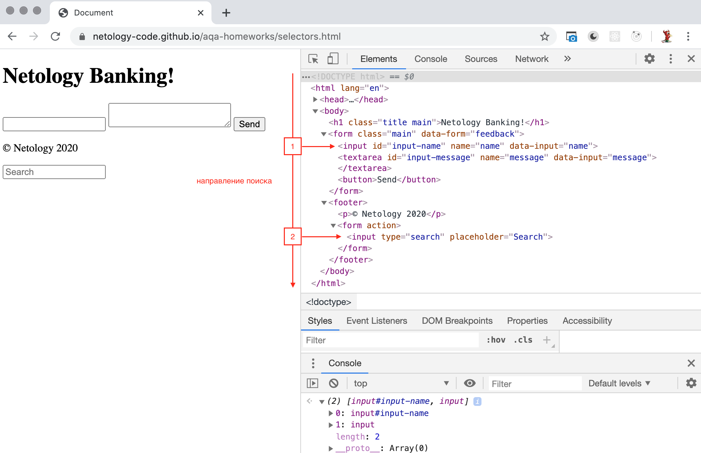

Как вы знаете, в большинстве языков программирования элементы индексируются с нуля, поэтому первый найденный элемент имеет индекс 0, а второй - 1.

Теперь попробуем найти не все элементы (`$$`), а только первый (`$`) - проскрольте панельку Console немного вниз, чтобы дойти по приглашения ввода:
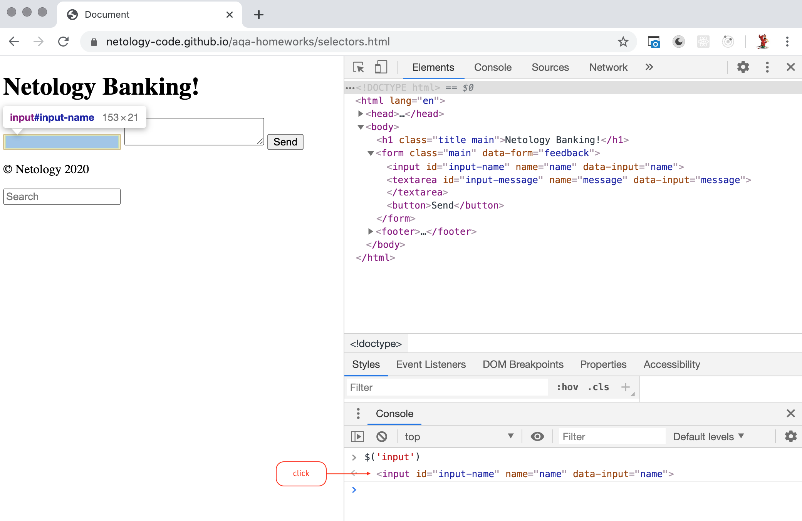

К сожалению, если вы кликнете на него (как на скриншоте выше), то он будет показан только на странице.

Чтобы увидеть его в дереве, надо кликнуть на нём правой кнопкой мыши и выбрать Reveal in Elements panel:
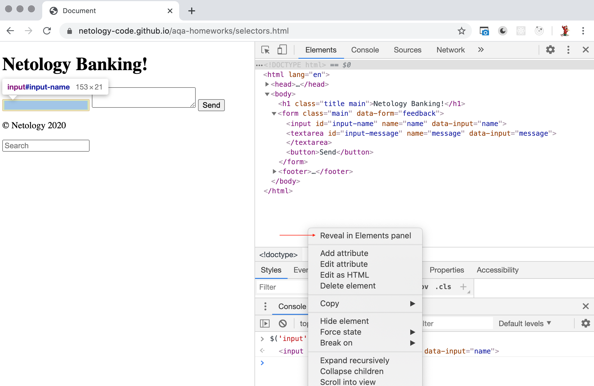

После этого он уже будет подсвечен в панели Elements:
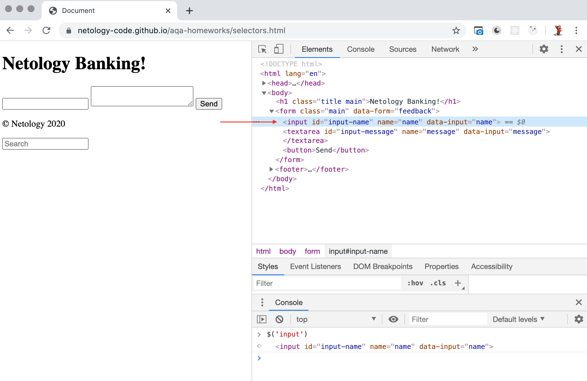

Как вы видите, логика поиска сохраняется: поиск осуществляется сверху вниз, но теперь берётся первый найденный.

Если мы случайно будем для поиска использовать тег, которого нет, то:

1\. В случае поиска всех элементов получим пустой список:
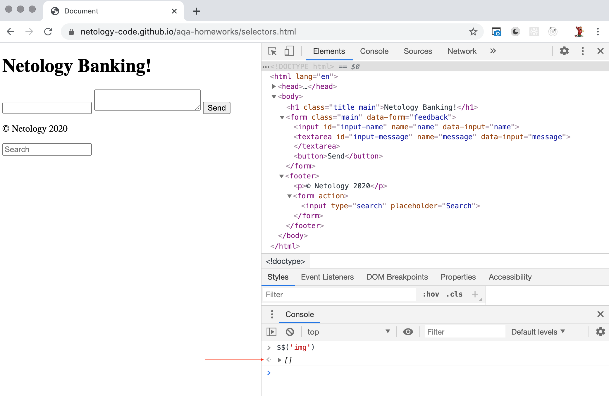

2\. В случае поиска одного элемента получим `null`:


Давайте посмотрим на другие селекторы.

#### Селектор по id

Селектор по `id` представляет из себя специальную запись с символом `#` и строкой `id` того элемента, котороый вы ищете.

Например, для `<textarea id="input-message">` селектор будет `#input-message` (т.е. мы взяли значение атрибута `id`):
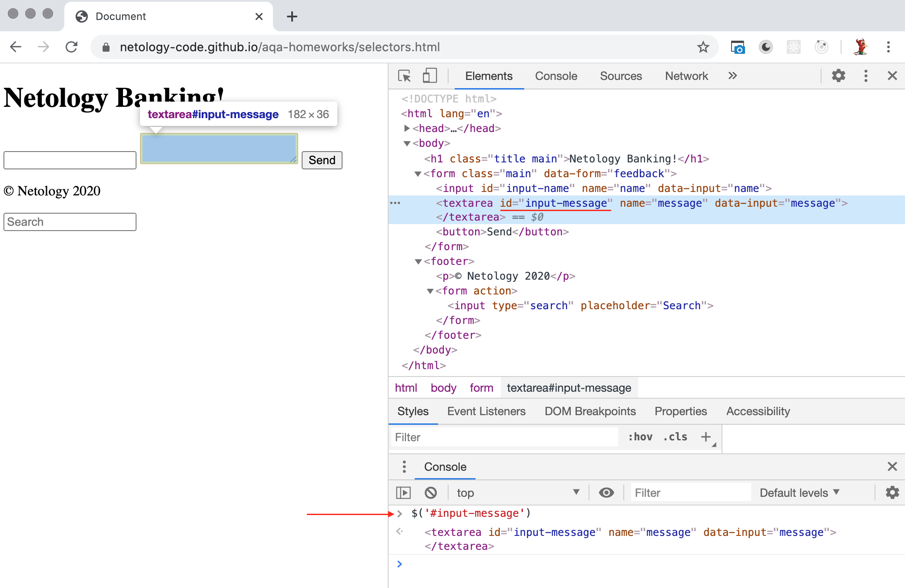

Обратите внимание, `id` означает уникальность, поэтому не нужно искать "много" элементов на странице по `id`.

В остальном, всё так же, как и для селектора по тегу: если элемента с таким `id` на странице в данный момент нет, мы получим `null`.

#### Селектор по имени класса

Селектор по классу представляет из себя специальную запись с символом `.` и одним из классов того элемента, котороый вы ищете.

Здесь ключевое отличие от всех остальных вариантов заключается в самой записи классов.

Например, у элемента `<h1 class="title main">Netology Banking!</h1>` два класса:
1. `title`
1. `main`

Т.е. атрибут `class` обрабатывается по-особому: там пишется список классов через пробел.

Выбирать мы можем по любому классу, например: `.main` (т.е. мы взяли одно значение из списка в атрибуте `class`):
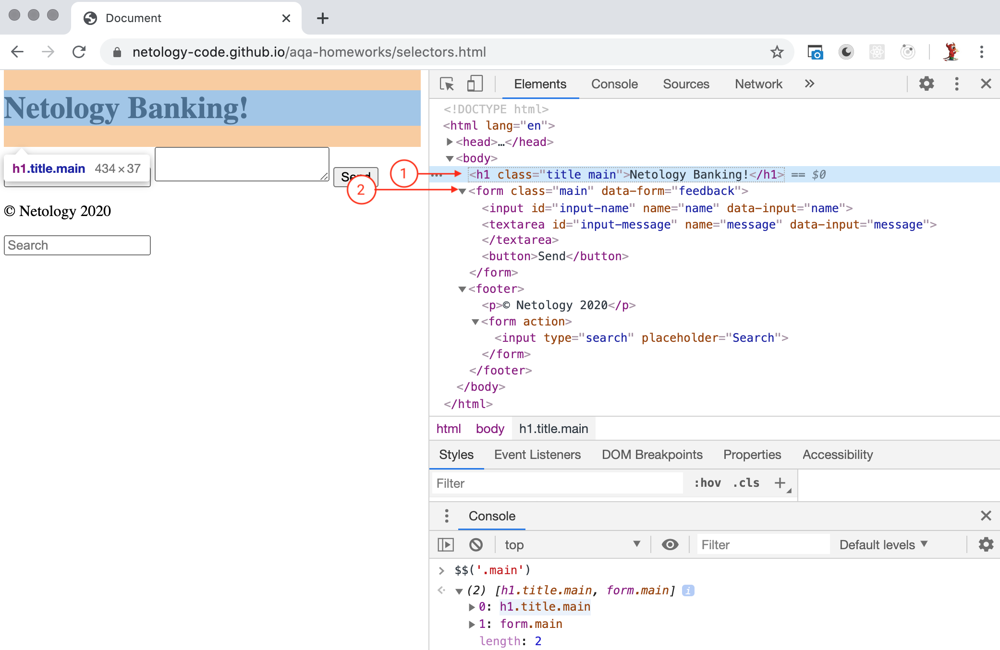:

Обратите внимание: были найдены те элементы, у которых в списке классов присуствует тот класс, который мы ищем.

#### Селектор по атрибуту

Селектор по атрибуту представляет из себя специальную запись в квадратных скобках `[]` и атрибутом того элемента, котороый вы ищете.

Здесь ключевое отличие от всех остальных вариантов заключается в гибкой настройке этого поиска.

Мы рассмотрим два ключевых варианта:

1 \. Поиск по наличию атрибута (ищем все элементы, у которых такой атрибут есть):
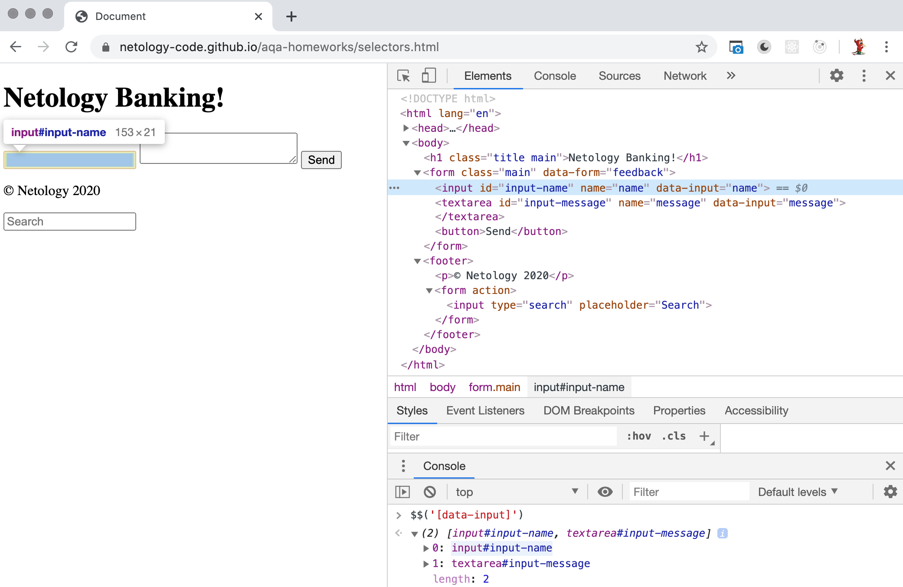

Обратите внимание, были найдены все элементы, у которых такой атрибут есть (не важно, какое значение у атрибута).

2 \. Поиск по значению атрибута (ищем все элементы, у которых такой атрибут есть и значение его равно чему-то конкретному):


Обратите внимание: мы взяли значение атрибута в кавычки (вам тоже рекомендуем, т.к. некоторые инструменты плохо реагируют на значения без кавычек).

В остальном механика работы этого селектора такая же, как и всех остальных.

### Последовательность simple селекторов

Simple селекторы можно выстраивать в последовательность, требуя соответствия всем селекторам, входящим в последовательность, например, `input[type="search"]` раскладывается на два simple:
1. `input` (селектор по тегу)
1. `[type="search"]` (селектор по значению атрибута)

Таким образом можно комбинировать достаточно много выражений.

Обратите внимание: `input[type="search"]` пробел между simple селекторами не ставится.

### Комбинированные селекторы

Комбинированные селекторы позволяют вам выбирать элементы, опираясь на то, какие "родственные" отношения они имеют.

Мы рассмотрим только два самых частых:
1. Descendant
1. Child

#### Descendant

Descendant комбинатор позволяет выбирать вам элементы, являющиеся дочерними элементами других не зависимо от уровня вложенности.

Например, на нашей странице есть целых два `input`'а, но мы хотим получить тот, что есть именно в `footer`, тогда селектор будет: `footer input`:
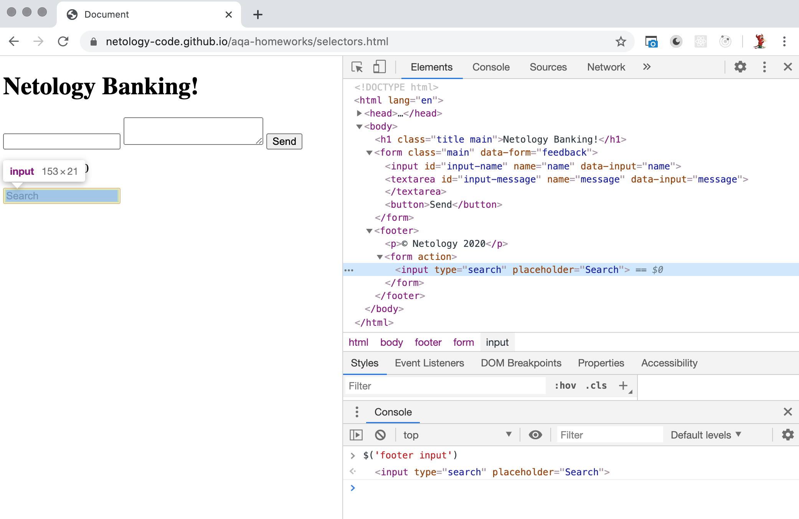

Обратите внимание на пробел (он обязателен).

Как это работает: мы ищем элемент `footer`, а внутри него - элемент `input` не важно, на какой бы глубине он не находился. Главное, что он находится внутри `footer`.

Мы можем так же написать `footer form input` - это будет значить, что внутри `footer` на любом уровне вложенности должен быть элемент `form`, внутри которого на любом уровне вложенности должен быть элемент `input`.

Это уже более жёсткое требование, чем просто `footer input`, поскольку требует чтобы был элемент `form`.

Напоминаем, что там, где мы сейчас использовали селектор по тегу, вы можете использовать любой simple селектор и их последовательность: `footer input[type="search"]`.

Descendant комбинатор (как и Child) не следует использовать, если вы можете обойтись Simple селектором или Sequence (последовательностью) Simple селекторов.

#### Child

Child комбинатор позволяет выбирать вам элементы, являющиеся прямыми потомками других элементов (т.е. непосредственными детьми).

Например, на нашей странице есть `p`, который находится внутри `footer`, тогда: `footer > p`:
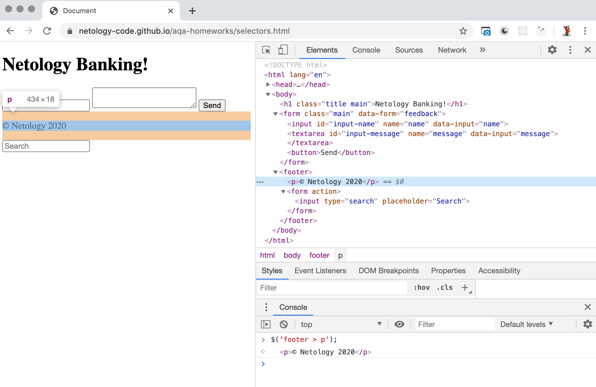

Обратите внимание на знак `>` - он определяет, что `p` должен быть внутри `footer` на первом уровне вложенности. Т.е. накладывает более сильные ограничения, чем Descendant.

Исходя из этого, `footer > input` вернёт `null`:
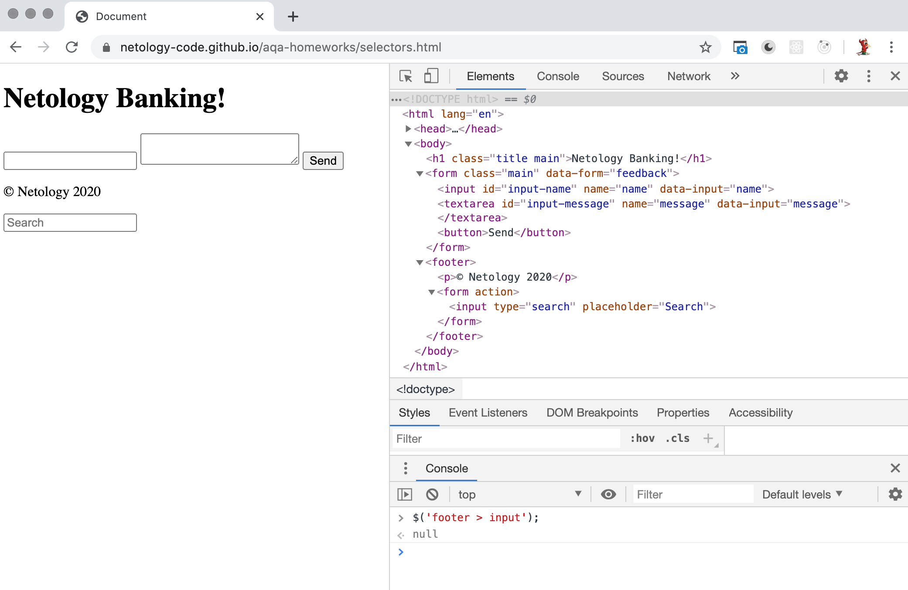

Но при этом, селектор `footer > form > input` будет работать, потому что мы найдём `footer`, внутри него найдём непосредственного ребёнка `form`, а уже внутри непосредственного ребёнка `input`.

## Что и когда использовать

Общая логика работы всегда одинакова:
1. Вы открываете страницу на вкладке Elements и ищете нужный вам элемент
1. Если у этого элемента есть какие-то уникальные атрибуты (возможно, также по `id` и `class` – это на самом деле тоже атрибуты), которые можно использовать для поиска, то используете их
1. Если нет - то смотрите на родителя и родителя родителя (и т.д.) пока такие атрибуты не найдёте

Если приложение написано с оглядкой на тестируемость, то вам достаточно будет п.1-п.2. Т.е. вам не нужны все те селекторы и приёмы, которые были описаны выше, кроме селекторов по атрибуту.

Разработчики стараются давать элементам атрибуты `data-id`, `data-testid` или подобные, чтобы вы их могли легко найти на странице, не прибегая к созданию сложных селекторов.

Т.е. вы просто используете обычный селектор по атрибуту: `data-testid="search-input"` (на нашей странице такого элемента нет).

В более сложных случаях вы находите родителя с уникальными атрибутами и работаете с ним, осуществляя поиск ребёнка внутри него.

Как это работает? На самом деле, нам не обязательно искать по всему документу. Мы можем найти какой-то элемент, а затем искать другие элементы внутри него.

К сожалению, консоль просто так не предоставляет возможность это сделать, но мы покажем код на примере Selenium.

Например, мы хотим найти все поля ввода и кнопки внутри формы с `data-form="feedback"`.

Тогда для Selenium:
```java
WebElement feedbackForm = driver.findElement(By.cssSelector("[data-form='feedback']"));
// теперь можем искать внутри элемента:
WebElement nameInput = feedbackForm.findElement(By.cssSelector("[data-input='name']"));
WebElement messageInput = feedbackForm.findElement(By.cssSelector("[data-input='message']"));
WebElement sendButton = feedbackForm.findElement(By.cssSelector("button"));
// И т.д.
```

